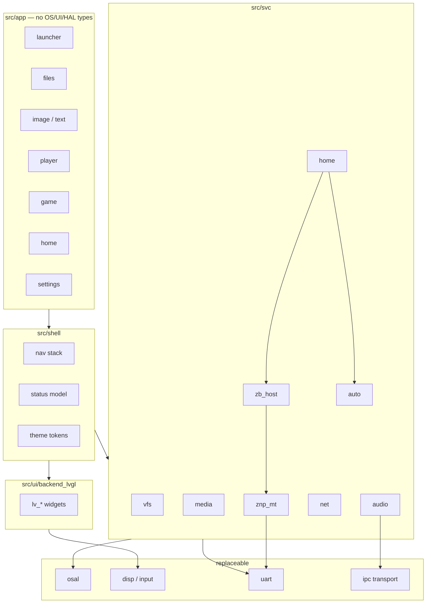
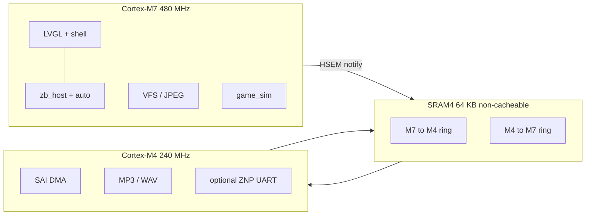
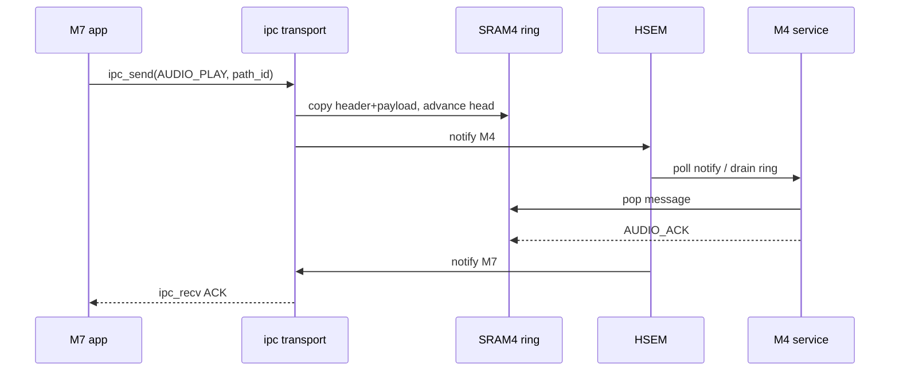
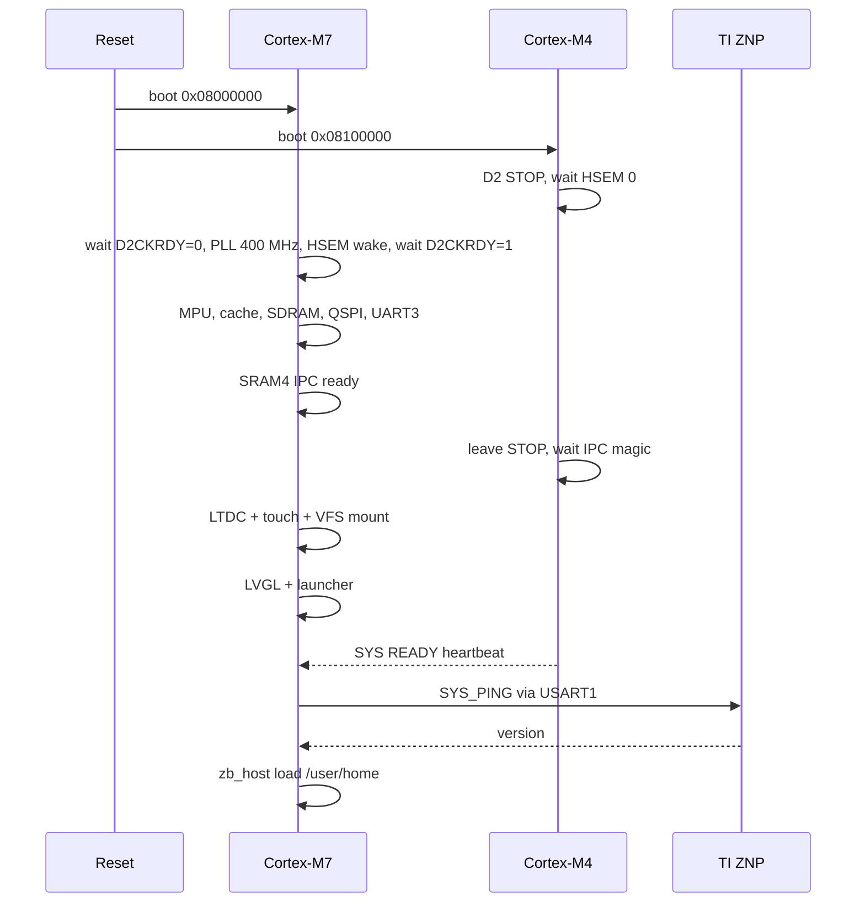
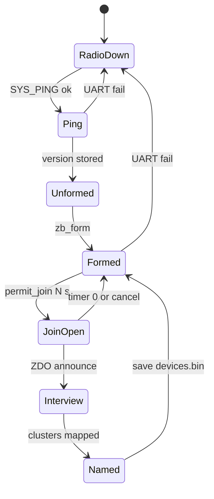
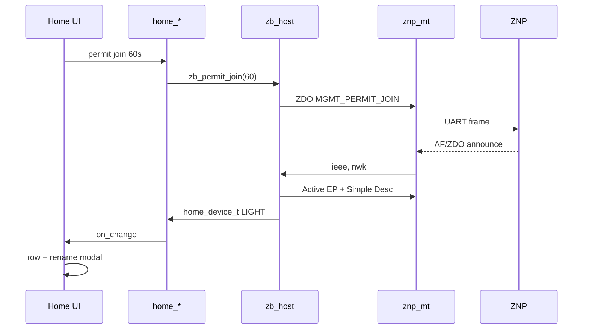
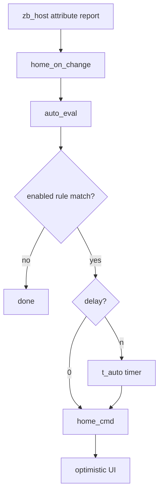
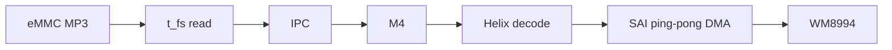
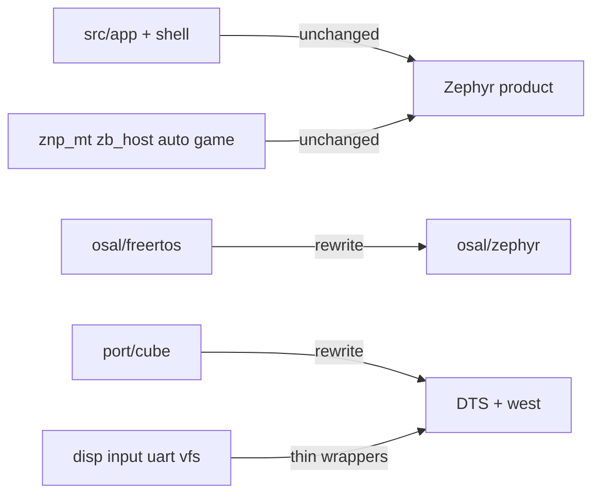

# Software Architecture

Portable HMI architecture for the STM32H745I-DISCO. Application code must not call FreeRTOS, Zephyr, LVGL, TouchGFX, FatFS, or STM32 HAL directly.

**Contents:** 1 Goals · 2 Hardware · 3 Layers · 3.1 Vendor · 4 Tree · 5 Cores · 6 Memory · 7 Interfaces · 8 UI · 9 Services · 10 Pins · 11 Build/CI · 12 Zephyr · 13 Boot · 14 Threads · 15 OSAL · 16 VFS · 16.1 USB MSC · 17 Zigbee · 18 Automation · 19 Audio · 20 Log · 21 Errors · 22 Migration

## 1. Goals

- Ship a usable dual-core HMI: launcher, files, image/text viewers, audio, **game**, **home automation**, and network status.
- Keep OS, UI toolkit, filesystem, and board drivers behind stable C interfaces.
- Allow a later move to **Zephyr + LVGL** without rewriting apps.
- Keep Cortex-M4 work real-time (audio DMA, optional network) and Cortex-M7 work latency-tolerant (UI, FS, decode).

## 2. Hardware baseline

| Item | Value |
| --- | --- |
| MCU | STM32H745XIH6 (M7 480 MHz, M4 240 MHz) |
| Display | 4.3" 480×272 RGB (RK043FN48H), FT5336 touch on I2C4 |
| Graphics | LTDC + DMA2D (Chrom-ART) + JPEG codec |
| SDRAM | `0xD0000000`, 8 MB usable (16-bit FMC) |
| QSPI NOR | `0x90000000`, dual 512 Mbit, memory-mapped XiP |
| eMMC | 4 GB, SDMMC1 |
| Audio | WM8994 on SAI, I2C4 shared with touch |
| Ethernet | LAN8740A MII; default pins collide with QSPI bank 2 |
| USB | OTG FS (micro-AB). Later TinyUSB MSC; not used in Sprint 0–3 |
| Wi-Fi | **Not on board.** Optional ESP32 on Arduino/STMod+ |
| Zigbee | **Not on board.** TI ZNP module on USART1 (Arduino) |
| Shared SRAM | SRAM4 64 KB at `0x38000000` (D3 domain) |

## 3. Layered design

```
┌─────────────────────────────────────────────────────────────┐
│  Apps (no toolkit/OS types)                                 │
│  launcher, files, image, text, player, game, home, settings │
├─────────────────────────────────────────────────────────────┤
│  Shell: navigation stack, status model, app registry        │
├─────────────────────────────────────────────────────────────┤
│  ui_backend  │  services                                    │
│  (LVGL now)  │  vfs, media, audio, net, home, game, time    │
├──────────────┴──────────────────────────────────────────────┤
│  OSAL   IPC protocol   disp/input HAL   media decode HAL    │
├─────────────────────────────────────────────────────────────┤
│  Ports: FreeRTOS + STM32Cube  →  later Zephyr + device tree │
│  BSP: clocks, MPU, cache, LTDC, SDMMC, SAI, ETH, QSPI       │
└─────────────────────────────────────────────────────────────┘
```

Rules:

1. Headers under `include/app` and `include/svc` may include only C11, project types, and OSAL.
2. LVGL (or any toolkit) lives only in `src/ui/backend_*`.
3. STM32 HAL / Zephyr DT live only in `src/port/*` and `src/bsp/*`.
4. Dual-core messages are structs with explicit endianness and version, never pointers to M7-only memory.



## 3.1 CubeH7 / vendor policy

Do **not** submodule the monolith [`STM32CubeH7`](https://github.com/STMicroelectronics/STM32CubeH7). That tree is every H7 Nucleo/DK/EVAL BSP, every demo (including TouchGFX), and ST forks of FreeRTOS, FatFS, LwIP, USB, mbedTLS. It would fight the portability rules and the later Zephyr swap.

Write **our** board BSP in `firmware/src/bsp/stm32h745i_disco/`. It owns clocks, MPU, pin mux, I2C4 mutex, cache, dual-core bring-up, and the `board_*` / `disp_*` / `input_*` / `uart_*` implementations. Apps never call `BSP_LCD_*` or include `stm32h745i_discovery.h`.

[`stm32h745i-disco-bsp`](https://github.com/STMicroelectronics/stm32h745i-disco-bsp) is a **read-only reference** (pin tables, SDRAM/QSPI/LTDC sequences). Do not link it. It pulls Cube Utilities, LCD log/fonts, and HAL types that we do not want above `port/cube`.

Pull **specific** ST component repos (chip datasheet drivers, not board wrappers) and **upstream** middleware, as git submodules, when a sprint needs them:

| Need | Take | Skip |
| --- | --- | --- |
| MCU registers, HAL, LL | `stm32h7xx-hal-driver`, `cmsis-device-h7`, `cmsis_core` (already) | Full `STM32CubeH7` |
| Panel timing, touch, codec, NOR, PHY | `stm32-rk043fn48h`, `stm32-ft5336`, `stm32-wm8994`, `stm32-mt25tl01g`, `stm32-lan8742` | `stm32h745i-disco-bsp`, other boards' components |
| SDRAM | Keep our `HAL_SDRAM_*` (Sprint 1). `stm32-mt48lc4m32b2` only if timings need a refresh | Board `bsp_sdram.c` |
| RTOS / UI / FS / net / MP3 | Upstream FreeRTOS-Kernel, LVGL, FatFS, LwIP, Helix | Cube `Middlewares/Third_Party/*`, TouchGFX, **littlefs** |
| USB MSC (later) | Upstream TinyUSB device MSC | Cube `USB_Device` / `USB_Host` |
| mbedTLS, LibJPEG | Only if a later requirement appears | Default out |

Component `.c` files compile into the BSP target and may include HAL. Wrap them so `src/app` and `src/shell` still see only `disp.h` / `input.h` / `vfs.h`. Format, cppcheck, and coverage exclude `third_party/`. Pin tags to the CubeH7 1.13.0 set (same family as HAL v1.11.6) unless a component release note says otherwise.

When Zephyr lands, ST components behind `disp_*`/`input_*` go away with `port/cube`; apps do not move.

## 4. Recommended source tree

```
firmware/
  include/
    osal/          osal.h
    ipc/           ipc.h, ipc_msg.h
    hal/           disp.h, input.h, audio_out.h, net_if.h, uart.h
    svc/           vfs.h, media.h, audio.h, audio_pipe.h, net.h, home.h, zb_host.h, znp_mt.h, auto.h, time.h
    game/          game_sim.h, gfx.h
    ui/            shell.h, nav.h, theme.h, launcher.h, backend.h, event.h
    app/           apps.h, player.h
  src/
    app/           launcher, files, image, text, player, game, home, settings
    shell/
    svc/
    ui/backend_lvgl/     ui_lvgl.c (MCU + PC sim); lv_port is BSP- or SDL-specific
    ipc/
    osal/freertos/           later: osal/zephyr/
    bsp/stm32h745i_disco/
    port/cube/               STM32Cube HAL/LL glue (later: port/zephyr/)
    port/lvgl/               lv_conf.h (MCU); lv_conf_sim.h (Sprint 5b PC)
tests/
  host/          PC unit tests (Unity), no HAL, no LVGL
  host/sim/      Sprint 5b: host_sim main + host-folder VFS (not unit tests)
  hil/           on-target scripts and fixtures
third_party/
  stm32h7xx-hal-driver/      ST HAL + LL (submodule, now)
  cmsis-device-h7/
  cmsis_core/
  stm32-ft5336/              ST component (now)
  stm32-rk043fn48h/          ST component (now)
  fatfs/                     elm-chan FatFs R0.15b (now)
  lvgl/                      upstream LVGL v9.5.0 (now)
  unity/                     ThrowTheSwitch Unity v2.6.1 (host unit tests)
  helix/                     ultraembedded libhelix-mp3 (Sprint 8)
  stm32-wm8994/              ST component (Sprint 8)
  tinyusb/                   upstream TinyUSB (later USB MSC sprint)
  stm32-mt25tl01g/           ST component (QSPI commands, when needed)
  stm32-lan8742/             ST component (Sprint 9)
  lwip/                      upstream LwIP 2.2.1 (Sprint 9)
  cmsis-svd/                 STM32H745_CM7/CM4 SVD (debug register view)
  lvgl/  FreeRTOS-Kernel/  fatfs/  lwip/  helix/  tinyusb/   upstream, per sprint
.settings/                   STM32CubeIDE for VS Code device store (dual-core)
CM7/                         Cube CMake context for Cortex-M7 (wrapper)
CM4/                         Cube CMake context for Cortex-M4 (wrapper)
.vscode/                     CMake Tools + ST-LINK launch/tasks
```

Two firmware images: `m7` and `m4`. They share only `include/ipc`.

## 5. Core split

```
          Cortex-M7                            Cortex-M4
          ---------                            ---------
          Shell + LVGL backend                 SAI DMA ping-pong
          VFS, JPEG, text paging               MP3/WAV decode
          ETH + LwIP (DHCP/ICMP)               (no ETH)
          zb_host + ZNP UART worker            Optional ZNP UART DMA
          home_* + local auto_*                (no framebuffer / no LVGL)
          IPC client, display, touch           IPC server
```

Bring-up order: M7 initializes clocks, MPU, and SRAM4, then formats the IPC control block and boots M4 (`RCC_GCR_BOOT_C2`). M4 waits for `m7_ready` before attaching. Do not put FatFS or LVGL on M4.

If Zephyr is adopted, keep the same split: M7 `stm32h745i_disco/stm32h745xx/m7`, M4 `.../m4`, IPC via HSEM mailbox then OpenAMP.



## 6. Memory map

### 6.1 Internal

| Region | Address | Size | Owner | Notes |
| --- | --- | --- | --- | --- |
| ITCM | `0x00000000` | 64 KB | M7 | Hot UI/decode routines |
| Flash bank 1 | `0x08000000` | 1 MB | M7 | Default boot |
| Flash bank 2 | `0x08100000` | 1 MB | M4 | Default CM4 boot |
| DTCM | `0x20000000` | 128 KB | M7 | Stacks, hard-RT data |
| AXI SRAM | `0x24000000` | 512 KB | M7 | LVGL working set, FS cache |
| SRAM1 | `0x30000000` | 128 KB | M4 | M4 .data/.bss/heap |
| SRAM2 | `0x30020000` | 128 KB | M4 / DMA | Audio PCM rings if not in SRAM3 |
| SRAM3 | `0x30040000` | 32 KB | M7 ETH DMA | Descriptors, Rx/Tx bounce, LwIP heap (MPU NC) |
| SRAM4 | `0x38000000` | 64 KB | Shared | IPC only, non-cacheable |
| Backup SRAM | `0x38800000` | 4 KB | Shared | Boot reason, net config flags |

### 6.2 External SDRAM (`0xD0000000`, 8 MB)

RGB565 is the default pixel format (480×272×2 = 261 120 bytes per full buffer).

| Offset | Size | Use |
| --- | --- | --- |
| `+0x000000` | 261 KB | LTDC framebuffer 0 |
| `+0x040000` | 261 KB | LTDC framebuffer 1 (double buffer) |
| `+0x080000` | 261 KB | LVGL draw buffer (or DMA2D staging) |
| `+0x0C0000` | ~2 MB | Image decode / scaler **or** game playfield + sprites (exclusive: viewers vs game) |
| `+0x2C0000` | remainder | File cache, text window, home state cache, heap fallback |

ARGB8888 is allowed later if color quality requires it; each full buffer then costs ~522 KB. Do not put M4 code/data in SDRAM.

### 6.3 QSPI and eMMC roles

| Media | Role | Mount / map |
| --- | --- | --- |
| QSPI NOR | Fonts, icons, firmware assets, optional XiP | Memory-mapped, read-only in production |
| eMMC | User files, albums, logs, optional OTA scratch | VFS mount `/user`, `/log` |
| Internal flash | Bootloaders, both core images | Not exposed in the explorer |

### 6.4 MPU and cache

- SRAM4: MPU **Device or Normal non-cacheable**, shared, no execute.
- DMA audio buffers: aligned, MPU non-cacheable **or** explicit clean/invalidate in `bsp_cache_*`.
- SDRAM framebuffers: write-through or normal + clean before LTDC flip.
- Never share a cached M7 buffer with M4 without a cache API call.

## 7. Public interfaces (stable)

Keep these headers OS- and toolkit-free.

### 7.1 OSAL

Threads, mutexes, recursive mutexes, semaphores, queues, timers, sleep, millis, heap. Timeouts in milliseconds. Fatal errors go to `osal_panic()` (log + reset policy).

First port: FreeRTOS. Second port: Zephyr. CMSIS-RTOS2 is acceptable as an intermediate, but apps still call `osal_*`.

### 7.2 Display and input

```c
typedef struct { uint16_t w, h, stride; disp_fmt_t fmt; } disp_info_t;
void disp_get_info(disp_info_t *info);
void disp_flush(const disp_rect_t *r, const void *pixels);
err_t disp_fill(const disp_rect_t *r, uint16_t rgb565);
void disp_swap(void);

typedef enum { INPUT_PTR_DOWN, INPUT_PTR_MOVE, INPUT_PTR_UP, INPUT_KEY, INPUT_BTN } input_kind_t;
bool input_poll(input_event_t *out);
```

LVGL `flush_cb` and `indev_read_cb` are adapters over `disp_flush` / `input_poll`. Zephyr `display_write` / `input` subsystems replace the BSP, not the apps.

UART (ZNP): `uart_open` / `uart_write` / `uart_read` / `uart_set_gpio` (RESET). Default ZNP link is **USART1** on the Arduino header (PB6/PB7), 115200 8N1. **USART3 is the console** and must not be used for ZNP. Optional RTS/CTS and a RESET GPIO live in the BSP pin map (Arduino or STMod+).

### 7.3 VFS

POSIX-like subset in `vfs.h`: `mount/open/read/write/seek/close/stat/opendir/readdir/mkdir`. Paths are UTF-8, `/` separated, jailed at `/user`. The on-disk format is **FAT** (FatFs now; Zephyr FAT or FatFs later). Do **not** add littlefs. FatFs `FIL` stays in `src/svc/vfs.c`; apps never include `ff.h`. Host tests use a RAM tree (`tests/host/vfs_ram.c`) so they do not link FatFs. USB MSC (later) is exclusive with this mount — see §16.1.

### 7.4 Media

```c
media_kind_t media_probe_ext(const char *path);
err_t media_decode_image(const char *path, image_buf_t *out, const image_req_t *req);
err_t media_decode_image_mem(const uint8_t *data, uint32_t size, image_buf_t *out,
                             const image_req_t *req);
int media_open_audio(const char *path, audio_stream_t *s);
```

JPEG uses the STM32 JPEG codec when present (`media_jpeg_hw_decode`); otherwise ChaN TJpgDec (software, also the host-test path). PNG/BMP are software. Destination is contain-fit RGB565 in the 480×200 content area. Failures return codes, never abort the UI.

Text paging: `text_view_*` keeps one `TEXT_WIN_MAX` (32 KB) window. Files larger than 256 KB are still shown; peak RAM for that buffer is the constant (plus a same-sized raw read scratch). On the MCU both live in SDRAM at `+0x2C0000`.

### 7.5 Game (sim + gfx)

Game **logic** is a pure tick function. Game **pixels** go through a tiny blit API. Neither includes LVGL.

```c
typedef struct {
    const char *id;     /* "brick" */
    void (*reset)(game_t *g, uint16_t w, uint16_t h);
    void (*input)(game_t *g, const input_event_t *e);
    void (*tick)(game_t *g, uint32_t dt_ms);
    void (*draw)(const game_t *g, gfx_t *fx);
} game_module_t;

void gfx_clear(gfx_t *fx, uint16_t rgb565);
void gfx_fill(gfx_t *fx, gfx_rect_t r, uint16_t rgb565);
void gfx_blit(gfx_t *fx, int x, int y, const gfx_sprite_t *s);
```

Host tests run `tick`/`input` with a fake `gfx` that records fill rects. The LVGL backend may implement `gfx_t` as an `lv_canvas` **or** a raw RGB565 buffer flushed with `disp_flush`. A later Zephyr port keeps `game_module_t`.

First bundled module: **Brick** (breakout-style paddle + bricks) on the 480×200 playfield. Extra modules (Snake, puzzle) register in the same host; do not fork the app.

While a game is foreground it may borrow the image-decode SDRAM window. Leaving the game releases that buffer.

### 7.6 Home automation (Zigbee host)

The STM32 is the **Zigbee host**. A TI **ZNP** (Z-Stack Network Processor, e.g. CC2652/CC1352/CC2538) is the radio, wired over UART. The panel shows the live device list, network controls, and local automations. Ethernet/MQTT is **not** required for Home.

```
  Home UI  ──►  home_*  ──►  zb_host (device table, interview, bind)
                     │              │
                     │              ▼
                     │         znp_mt  (SYS / ZDO / AF / SAPI)
                     │              │
                     │              ▼
                     │         uart_*  → TI ZNP
                     ▼
                 auto_*  (rules on M7, host-testable)
```

`src/app/home` never includes MT command IDs, UART HAL, or MQTT.

```c
/* home_* — UI model */
typedef enum { HOME_LIGHT, HOME_SWITCH, HOME_BINARY_SENSOR, HOME_CLIMATE } home_kind_t;

size_t home_devices(const char *room_id, home_device_t *out, size_t max);
int    home_cmd(const char *device_id, const home_cmd_t *cmd);
int    home_set_meta(const char *device_id, const char *name, const char *room_id);
void   home_on_change(void (*cb)(const home_device_t *));

/* zb_host — coordinator */
int zb_form(const zb_net_cfg_t *cfg);     /* channel mask, PAN, as coordinator */
int zb_permit_join(uint8_t seconds);       /* 0 = close */
int zb_leave(const uint8_t ieee[8]);
int zb_interview(const uint8_t ieee[8]);   /* endpoints + simple descriptors */

/* auto_* — local, no cloud */
int auto_add(const auto_rule_t *r);
int auto_eval(const home_device_t *changed);  /* called from zb_host reports */
```

| Layer | First port | Later |
| --- | --- | --- |
| `uart_*` | STM32 USART DMA | Zephyr `uart` DT |
| `znp_mt` | TI MT framing on UART | unchanged |
| `zb_host` | Coordinator host on M7 | unchanged (or M4 UART + IPC `ZB`) |
| `home_*` | Maps clusters → lights/switches/sensors | unchanged |
| `auto_*` | Pure C rules | unchanged |
| `mock` | Host tests / no dongle | still required |

**Device table** (RAM + eMMC `/user/home/devices.bin`): IEEE, NWK addr, name, room, endpoints, in/out clusters, last OnOff/Level/temp/zone, LQI, last-seen. Kind is inferred from clusters (OnOff+Level → light, IAS Zone / Occupancy → binary sensor, Temperature → climate). Capacity: **8 rooms, 32 devices**.

**Network state** (`/user/home/network.bin`): formed flag, channel, PAN, ext-PAN. The Zigbee network key stays on the ZNP NVM; the host does not copy it into git or logs. eMMC holds names/rooms/rules only.

**Local automation** examples: occupancy → light on for N seconds; button → toggle; temperature threshold → switch. Triggers, conditions, and actions are data, not hardcoded screens. Rules persist in `/user/home/rules.bin`.

**Bring-up:** M7 USART1 + DMA worker first. If UART ISR load fights LVGL, move `znp_mt` to M4 and keep `zb_host` / `home_*` on M7 over IPC endpoint `ZB`.

**MQTT / Home Assistant:** P2 optional export behind `home_*`. Not the control path.

Commands and interviews run on a worker. Optimistic UI: toggle immediately, revert + toast on `home_cmd` failure. Offline ZNP: banner “Radio not ready”, last-known device list still shown.

### 7.7 IPC

Transport and protocol are separate.

**Protocol** (`ipc_msg.h`): versioned header `{magic, ver, src, dst, type, flags, seq, len}` + payload. Endpoints: `SYS`, `AUDIO`, `NET`, `LOG`, optional `ZB`. No pointers in payloads. Zigbee host stays on M7 unless ZNP UART is offloaded to M4.

**Transport now:** two lockless rings in SRAM4 + HSEM notify.

**Transport later:** OpenAMP / RPMsg over the same SRAM4 carve-out. Apps keep calling `ipc_send` / `ipc_recv`.

SRAM4 sketch (64 KB):

| Offset | Size | Use |
| --- | --- | --- |
| 0 | 256 | Control: magic `IPC1`, version, nslots, ready flags, M4 heartbeat, kick counters |
| 256 | 16 KB | M7→M4 ring (head/tail at start of window, then 60 slots) |
| 16640 | 16 KB | M4→M7 ring (same layout) |
| 33024 | 16392 | Encoded bitstream pipe (`audio_pipe_t`, 16 KB SPSC) |
| 49416 | rest | Reserved (future RPMsg vring) |

Rings are SPSC and lockless: the producer only advances `head`, the consumer only advances `tail`. Occupancy is `(uint16_t)(head - tail)` so all N slots are usable. A full ring returns `ERR_NOSPC` and does not overwrite. HSEM (sem 0 M7→M4, sem 1 M4→M7) is a notify; both cores also poll and drain every main-loop pass, so correctness does not depend on the IRQ. Vector table stays the 16 Cortex-M exceptions; HSEM IER is armed but NVIC is not.

Latency budget: command round-trip **< 2 ms** for control messages. Encoded audio bytes use the dedicated SRAM4 pipe; PCM stays in M4 SAI DMA ping-pong buffers and does not ride the control ring.



Message header (little endian, packed):

| Offset | Size | Field |
| --- | --- | --- |
| 0 | 2 | magic `0xA55A` |
| 2 | 1 | version (1) |
| 3 | 1 | src endpoint |
| 4 | 1 | dst endpoint |
| 5 | 1 | flags (ACK, NAK, MORE) |
| 6 | 2 | type |
| 8 | 2 | seq |
| 10 | 2 | payload length |
| 12 | n | payload (≤ 256 for control) |

Endpoints: `SYS=1`, `AUDIO=2`, `NET=3`, `LOG=4`, `ZB=5`. Types for AUDIO: PLAY, PAUSE, RESUME, STOP, VOLUME, POS, ACK, NAK, UNDERRUN. SYS: HEARTBEAT, READY, PANIC.

## 8. UI architecture

Apps implement a small contract:

```c
typedef struct {
    const char *id;          /* "files" */
    const char *title;
    const void *icon;        /* id, not an LVGL image */
    void (*on_start)(void *args);
    void (*on_stop)(void);
    void (*on_tick)(uint32_t dt_ms);
    void (*on_event)(const ui_event_t *e);
} ui_app_t;
```

Shell owns:

- Screen stack (`push` / `pop` / `replace`).
- Status model (time, net, storage, audio).
- Modal errors and toasts.
- Theme tokens (colors, font sizes, hit-target min 40 px).

The LVGL backend draws those models. A future backend can draw the same models. **Do not** call `lv_*` from `src/app`.

**PC simulator (Sprint 5b):** same `ui_lvgl.c` on Ubuntu and Windows via LVGL’s SDL2 driver. Do not fork a Win32 UI or an X11 UI. Only the display/input/tick port, `lv_conf_sim.h` (host heap), and a host-folder `vfs_*` differ. The `host-sim` CMake target is separate from `host-tests`.

See `UI_Design.md` for layout and screens.

## 9. Services

| Service | Core | Responsibility |
| --- | --- | --- |
| `vfs` | M7 | Mounts, jail, extension → app dispatch |
| `media` | M7 | Probe and decode images; open audio files |
| `audio` | M7 API, M4 engine | Play/pause/seek, volume, now-playing |
| `net` | One core only | Link state, IPv4, optional failover |
| `home` | M7 | Device list, rooms, commands, last-known cache |
| `zb_host` / `znp_mt` | M7 (UART); optional M4 | TI ZNP coordinator: form, permit join, interview, AF |
| `auto` | M7 | Local rules on attribute reports and time |
| `game` | M7 | Sim tick + gfx; high scores in `/user/game` |
| `time` | M7 | RTC display; NTP is P2 |
| `settings` | M7 | Key/value in eMMC (names, rooms, rules; not Zigbee keys) |

Audio path: M7 VFS-reads encoded bytes into the SRAM4 pipe and sends `{kind, channels, bits, volume, sample_hz}` on the control ring. The UI path string (≤ 96 bytes) stays on M7; never a `FIL*`. M4 Helix/WAV-decodes and feeds SAI DMA. Analogue volume is on the WM8994 (M7/I2C4); M4 PCM is full-scale. M7 never blocks the UI thread on decode.

Network ownership: **M7** runs ETH + LwIP (no RTOS; M4 owns SAI). Never initialize ETH on both cores. Apps talk only to `net_*` / `time_*`.

## 10. Pin and bus constraints

- **I2C4:** FT5336 + WM8994. BSP provides a mutex; no driver talks to I2C4 directly.
- **USART3:** ST-LINK VCP console only.
- **USART1 (Arduino PB6/PB7):** default TI ZNP UART. Optional RESET GPIO on an Arduino pin. Do not share this UART with ESP32 AT; pick one expansion map per build.
- **Ethernet vs QSPI bank 2:** default solder map (SB3/SB4 OFF, R38/R40 ON) keeps PH2/PH3 on QSPI. Ethernet is MII **100 Mbit/s full-duplex** without CRS/COL. Documented in `firmware/src/bsp/stm32h745i_disco/README.md`.
- **LTDC pixel clock** and SDRAM bandwidth: RGB565 double-buffer + DMA2D is the safe default at 480×272.
- **USB OTG FS:** later TinyUSB MSC only. Do not bring up Cube USB alongside it.

## 11. Build, log, test, CI

- CMake presets: `Debug` / `Release` (Ninja superbuild, both cores; STM32 VS Code default), `m7-debug`, `m4-debug`, `host-tests`, and (Sprint 5b) `host-sim`. ELFs are `CM7/build/stm32h745-disco_CM7.elf` and `CM4/build/stm32h745-disco_CM4.elf`.
- Local firmware builds use the STM32 VS Code CubeCLT `arm-none-eabi-gcc` (same CubeMX `gcc-arm-none-eabi.cmake` as blinky). That compiler is not on a normal shell PATH.
- STM32Cube: `third_party/stm32h7xx-hal-driver` (HAL + LL), only included from `src/port/cube` and `src/bsp`. STM32CubeIDE for VS Code uses the CubeMX dual-core layout: root `mx-generated.cmake` (`ST_MULTICONTEXT=DUAL_CORE` + `ExternalProject` per core), per-core `CM7/` + `CM4/` CMake projects/presets, `.settings/ide.store.json`, and `.vscode/launch.json`. Register view SVD files live in `third_party/cmsis-svd/` (not CubeCLT).
- Logs: UART3 115200 8N1, tagged `core,lvl,mod,msg`. No `printf` to ITM as the only log.
- Host tests compile `svc` + `ipc` protocol + `game_sim` + `znp_mt` + `auto` + **shell/nav** with a POSIX OSAL stub. They must not link LVGL, SDL, or FatFs.
- Host simulator (Sprint 5b) **does** link LVGL + SDL2. It is a developer window, not the coverage suite. Ubuntu and Windows are both required; CI only has to **link**.
- HIL tests run on the Discovery board via VCP.
- Pull-request CI is specified in `CICD.md`: format, layering, cppcheck, clang-tidy, gcov floors, ARM GCC link. After Sprint 5b, also link `host-sim` on Ubuntu and Windows.

## 12. Later Zephyr + LVGL migration

If LVGL is already the backend, the remaining work is a **port swap**, not an app rewrite:

1. Replace `osal/freertos` with `osal/zephyr`.
2. Replace `port/cube` + Cube clock init with Zephyr DTS (`stm32h745i_disco`).
3. Map `disp_*` to Zephyr display, `input_*` to FT5336 input, `vfs_*` to a **FAT** volume on eMMC (same layout). Do **not** switch `/user` to littlefs.
4. Map `ipc` transport to `ipm` / OpenAMP; keep `ipc_msg.h`.
5. Keep `src/app` and `src/shell` unchanged except Kconfig feature flags.
6. Keep `game_module_t` / `gfx_*`; only the canvas flush changes.
7. Keep `home_*` / `zb_host` / `auto_*`; replace only `uart_*` (STM32 HAL → Zephyr UART). MT protocol stays.

Do not introduce TouchGFX. Do not scatter `#ifdef ZEPHYR` inside apps.

---

## 13. Boot sequence



M7 does not wait forever for ZNP. If SYS_PING fails, Home shows “Radio not ready” and the rest of the shell still runs.

## 14. Thread model (M7)

| Thread | Prio (high=low number) | Period | Notes |
| --- | --- | --- | --- |
| `t_ui` | 4 | LVGL tick ~5 ms | No VFS, no UART, no JPEG |
| `t_input` | 3 | event | optional; may merge into UI |
| `t_fs` | 5 | work queue | VFS, decode, listing |
| `t_zb` | 4 | UART worker | MT parse, interview |
| `t_auto` | 6 | 100 ms | rule eval, delays |
| `t_ipc` | 3 | notify | drain SRAM4 |
| `t_idle` | idle | — | WFI |

M4: `t_audio` (highest), `t_ipc`, optional `t_net` or `t_znp_uart`.

## 15. OSAL API (minimum)

```c
osal_status_t osal_thread_create(osal_thread_t *t, const osal_thread_attr_t *a, osal_fn fn, void *arg);
osal_status_t osal_mutex_lock(osal_mutex_t *m, uint32_t timeout_ms);
osal_status_t osal_sem_take(osal_sem_t *s, uint32_t timeout_ms);
osal_status_t osal_queue_send(osal_queue_t *q, const void *msg, uint32_t timeout_ms);
osal_status_t osal_queue_recv(osal_queue_t *q, void *msg, uint32_t timeout_ms);
void          osal_sleep_ms(uint32_t ms);
uint32_t      osal_millis(void);
void         *osal_malloc(size_t n);
void          osal_free(void *p);
void          osal_panic(const char *why);
```

Timeout `0` = try, `0xFFFFFFFF` = forever. `osal_malloc` may return NULL; callers must handle it.

## 16. VFS jail and mounts

```
/user          eMMC FAT  — explorer root (only user volume)
/user/home     devices.bin, network.bin, rules.bin
/user/game     brick.sav
/log           optional rotate
/qspi          not a VFS mount; assets are pointers / IDs
```

Rejected paths: `..` segment, NUL, backslash, leading `//`, any canonical path outside `/user` for explorer APIs. `vfs_normalize` / `vfs_jail_rel` are the normalizers; host-tested.

**FAT stays.** `/user` is a FAT volume on eMMC. littlefs is out: the board already has an eMMC FTL, and a later USB MSC LUN must be FAT so a PC can mount it. For small records that need power-loss safety, write `*.tmp`, `rename`, and `f_sync` — do not add a second filesystem.

### 16.1 USB MSC (later)

Opt-in exclusive **USB file transfer** (Settings), not always-on. TinyUSB device MSC presents the eMMC FAT volume as one LUN over OTG FS.

While a host is connected: unmount FatFs, stop audio/decode/home flushes, do not list `/user`. On unplug: remount, drop caches. Never two writers on the same FAT.

MSC exposes the **volume**, not the `/user` jail. The PC can see and delete `/user/home`. Apps still never include TinyUSB or Cube USB headers.

## 17. Zigbee join and interview

TI MT UART framing (host-testable in `znp_mt`):

| Byte | Meaning |
| --- | --- |
| 0 | SOF `0xFE` |
| 1 | LEN |
| 2 | CMD0 |
| 3 | CMD1 |
| 4.. | payload LEN bytes |
| last | FCS = XOR of LEN..payload |





Cluster map:

| In-cluster | Kind | Primary state |
| --- | --- | --- |
| OnOff + Level | LIGHT | on/off, brightness |
| OnOff only | SWITCH | on/off |
| Occupancy / IAS Zone | BINARY_SENSOR | occupied/clear or alarm |
| Temperature Measurement | CLIMATE | °C |

## 18. Local automation engine

Rule record (`auto_rule_t`):

| Field | Type | Notes |
| --- | --- | --- |
| id | u16 | 1..64 |
| enabled | bool | |
| name | char[24] | UI |
| trig_ieee | u8[8] | or wildcard time |
| trig_attr | enum | OCCUPIED, ON, TEMP_GT, TIME |
| thresh | i16 | for TEMP_GT |
| cond_ieee | optional | |
| action_ieee | u8[8] | |
| action_cmd | ON/OFF/TOGGLE/LEVEL | |
| delay_ms | u32 | 0 = immediate |



Max **32 rules**. Eval is O(rules) per report; keep it on `t_auto`, not `t_ui`.

## 19. Audio path



UI sends a path string ≤ 96 bytes or an `ipc_audio_fmt_t`; never a `FIL*`. Encoded bytes use the SRAM4 pipe, not the control ring.

## 20. Logging

USART3 115200 8N1:

```
<ms> <core> <lvl> <mod> <msg>
  12 M7 INF vfs  mounted /user
```

Levels: FAT, ERR, WRN, INF, DBG. No Zigbee keys or IEEE-as-secret in INF. IEEE may appear in DBG.

## 21. Error codes

Shared `err.h`: `OK=0`, `BUSY`, `TIMEOUT`, `NOMEM`, `NOENT`, `INVAL`, `IO`, `NOSPC`, `DENIED`, `CORRUPT`, `UNSUPPORTED`. Map FatFS / MT status to these at the port boundary.

## 22. Zephyr migration flowchart



