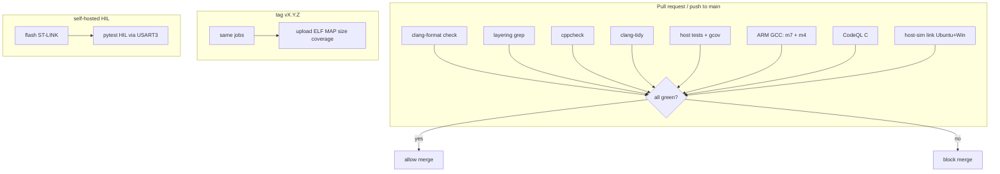
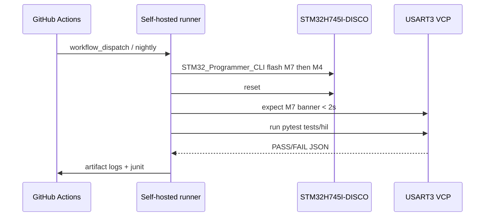

# CI/CD, static analysis, and coverage

This document is the quality gate for firmware in `firmware/` and host tests in `tests/host`. After Sprint 5b, CI also **links** the SDL host simulator on Ubuntu and Windows (no display required). HIL on the Discovery board is a **later, optional** pipeline on a self-hosted runner. Cloud CI never needs a board.

Related: `Architecture.md` (tree and ports), `Requirements_and_Test_Cases.md` (REQ-CI-*), `Plan.md` (Sprint 0 includes the first workflow).

## 1. Goals

1. Every pull request is **built, analyzed, and unit-tested** before merge.
2. Host-testable C (VFS jail, IPC rings, MT framing, automation, Brick sim) has **measured coverage**.
3. Apps cannot silently include LVGL / HAL / FreeRTOS (`REQ-SYS-02`).
4. Cross-compile M7 and M4 ELF images so Zephyr/Cube port breaks are caught in CI.
5. Releases attach reproducible artifacts (ELF, MAP, size report, coverage HTML).

## 2. What runs where



| Job | Machine | Board? | Blocks merge? |
| --- | --- | --- | --- |
| Format (`clang-format`) | GitHub ubuntu | No | Yes |
| Layering grep | ubuntu | No | Yes |
| cppcheck | ubuntu | No | Yes (error severity) |
| clang-tidy | ubuntu | No | Yes (errors + selected warnings) |
| Host tests + coverage | ubuntu gcc | No | Yes (fail + coverage floor) |
| Cross-compile M7/M4 | ubuntu + `gcc-arm-none-eabi` | No | Yes |
| Host sim link (Sprint 5b) | ubuntu + windows, SDL2 | No | Yes (link only) |
| CodeQL | GitHub | No | Yes on high/critical |
| HIL | Self-hosted + DISCO | Yes | No until Sprint 13 |

## 3. Repository layout for CI

```
.github/
  workflows/
    ci.yml              # PR + main
    codeql.yml          # weekly + PR
    release.yml         # tags
    hil.yml             # workflow_dispatch / self-hosted
  CODEOWNERS
  pull_request_template.md
cmake/
  HostTests.cmake
  HostSim.cmake             # Sprint 5b: LVGL + SDL2, not unit tests
  Helix.cmake               # Sprint 8: libhelix-mp3 sources + C fallback
  Firmware.cmake
  Cube.cmake
  Coverage.cmake
gcc-arm-none-eabi.cmake     # CubeMX / STM32 VS Code toolchain (CubeCLT on PATH)
starm-clang.cmake
mx-generated.cmake          # dual-core ExternalProject superbuild
.settings/ide.store.json    # STM32 VS Code device (STM32H745XIH6, dual-core)
CM7/ CM4/                   # per-core Cube CMake contexts
.vscode/                    # CMake Tools presets + ST-LINK debug (in-tree SVD)
scripts/
  ci/
    check-layering.sh
    check-format.sh
    size-report.sh
.clang-format
.clang-tidy
.cppcheck
```

Host tests **must not** link STM32 HAL, LVGL, SDL, or FatFs. They compile `src/svc`, `src/ipc`, `src/game` with `src/osal/posix` (or a tiny stub) and run under **Unity** (`third_party/unity`, v2.6.1). The Sprint 5b `host-sim` target is the only host binary allowed to link LVGL + SDL2.

## 4. Toolchain versions (pin in CI)

| Tool | Version policy |
| --- | --- |
| CMake | ≥ 3.22 |
| Host compiler | GCC 13 (ubuntu) **and** optionally Clang 18 |
| Coverage | `gcov` from host GCC + `gcovr` |
| Cross | `gcc-arm-none-eabi` 13.x (apt or ARM tarball, hashed) + `ninja-build` for the VS Code `Debug` preset |
| clang-format | 18 |
| clang-tidy | 18 |
| cppcheck | ≥ 2.13 |
| CodeQL | GitHub default `cpp` pack |
| Python | 3.11 (HIL scripts only) |

Pin apt packages or download hashes so a runner image bump cannot silently change MISRA findings.

## 5. Pipeline: `ci.yml`

Triggers: pull request to `main`, push to `main`.

### 5.1 Format

```
clang-format --dry-run --Werror -i firmware tests
```

Style: 4-space indent, 100-column, no tabs, `BasedOnStyle: LLVM` with project overrides in `.clang-format`. Do not format third_party (LVGL, FatFS, Helix, Cube HAL).

### 5.2 Layering (forbidden includes)

`scripts/ci/check-layering.sh` fails if any of these appear under `firmware/src/app` or `firmware/src/shell`:

```
lvgl.h  lv_*.h
touchgfx/
FreeRTOS.h  task.h  semphr.h
zephyr.h  <zephyr/
ff.h  fatfs
stm32h7xx.h  stm32h7xx_hal.h
mqtt
lwip
```

Also fail if `firmware/src/svc` includes `lv_`. `znp_mt.c` may include only `uart.h` + project types, not `stm32h7xx_hal_uart.h` (that stays in `port/`).

### 5.3 cppcheck (static analysis)

```
cppcheck --project=compile_commands.json \
  --enable=warning,style,performance,portability \
  --error-exitcode=1 \
  --inline-suppr \
  --suppress=missingIncludeSystem \
  --std=c11 \
  -i firmware/third_party
```

Treat `error` and `warning` as fail. `style` starts as report-only until Sprint 3, then fail.

Optional MISRA C:2012 addon when a license/addon is available; until then enforce a **subset** with clang-tidy + cppcheck:

- No implicit int, no dead stores, no buffer overrun, no unused values.
- Cyclomatic complexity: clang-tidy `readability-function-cognitive-complexity` threshold **25** for `src/app` and `src/svc`.

### 5.4 clang-tidy

Driven by `compile_commands.json` from CMake (`CMAKE_EXPORT_COMPILE_COMMANDS=ON`).

Enabled checks (initial):

```
clang-diagnostic-*
clang-analyzer-*
bugprone-*
cert-*
-clang-analyzer-security.insecureAPI.DeprecatedOrUnsafeBufferHandling
readability-function-cognitive-complexity
```

Disable noisy `llvm-*` / `google-*`. Third_party is `-isystem` so tidy skips it.

### 5.5 Host tests + coverage

```
cmake -S . -B build-host -DHOST_TESTS=ON -DCOVERAGE=ON
cmake --build build-host
ctest --test-dir build-host --output-on-failure
gcovr --root . --filter 'firmware/src/svc|firmware/src/ipc|firmware/src/game' \
  --exclude 'firmware/third_party|firmware/src/port|firmware/src/bsp' \
  --fail-under-line 80 --fail-under-branch 60 \
  --xml coverage.xml --html-details coverage.html
```

Upload `coverage.xml` as an artifact. Optionally Codecov later; do not block on an external SaaS in Sprint 0.

**Coverage floor (gate):**

| Unit | Line | Branch |
| --- | --- | --- |
| `src/ipc` | 90% | 75% |
| `src/svc` (vfs jail, auto, znp_mt, home mock) | 80% | 60% |
| `src/game` | 80% | 60% |
| Combined filter above | **80%** | **60%** |
| `src/bsp`, `src/port`, LVGL | not measured | — |

New files under the filter that drop the combined floor fail the job.

### 5.6 Cross-compile

Two CMake presets in CI:

- `Debug` → Ninja superbuild, both `CM7/build/firmware-m7.elf` and `CM4/build/firmware-m4.elf` (STM32 VS Code / CubeMX ExternalProject path)
- `m7-debug` / `m4-debug` → Ninja superbuild, one core each (same ELF paths)

CI only needs **link success** and a size report (`arm-none-eabi-size`). Flash/run is HIL. The cross job checks out git submodules (`stm32h7xx-hal-driver` HAL+LL, `cmsis-device-h7`, `cmsis_core`, FatFs, LVGL).

`scripts/ci/size-report.sh` prints text + `.bss/.data/.text` vs budgets:

| Image | Flash budget | RAM budget (internal) |
| --- | --- | --- |
| M7 | 960 KB of 1 MB bank | DTCM 128 KB + AXI 512 KB (warn > 80%) |
| M4 | 960 KB of 1 MB bank | SRAM1+2 256 KB (warn > 80%) |

Fail if flash exceeds budget. RAM warn is non-fatal until Sprint 13.

### 5.7 Host simulator (Sprint 5b)

Separate from `host-tests`. After the sprint lands:

```
# Ubuntu
sudo apt-get install -y libsdl2-dev
cmake --preset host-sim
cmake --build --preset host-sim

# Windows (vcpkg or FetchContent SDL2)
cmake --preset host-sim
cmake --build --preset host-sim
```

CI jobs: `ubuntu-24.04` and `windows-2022` **link** `host_sim`. Do not require a display, xvfb, or screenshot gate. Do not fold LVGL/SDL into the gcov floor.

### 5.8 CodeQL

GitHub `codeql-action` with `languages: cpp`. Queries: `security-and-quality`. Fail on **error** severity. Run on PR and weekly cron.

## 6. Release pipeline

On tag `v*.*.*`:

1. Run the same CI jobs.
2. Build `m7-release` and `m4-release` (`-Os`, no asserts that call `printf`).
3. Attach: ELF, HEX, MAP, `size.txt`, `coverage.html`, `sbom` of third_party versions.
4. Generate notes from merged PRs.

Do not auto-flash hardware from GitHub-hosted runners.

## 7. HIL pipeline (Sprint 7+)

Self-hosted runner with ST-LINK udev access.



HIL is **non-blocking** until Sprint 13. Nightly still reports on `main`.

## 8. Branch protection (GitHub)

On `main`:

- Require `ci.yml` jobs (all except HIL).
- Require linear history or squash merge.
- No direct push except emergency (document in CODEOWNERS).
- Required review: 1 (or owner for a solo repo: still require CI).

PR template checklist: layering, tests for new `svc` code, coverage not dropped, docs updated.

## 9. Local developer loop

Same commands as CI, wrapped:

```
cmake --preset host-tests
ctest --preset host-tests
ninja -C build-host coverage
scripts/ci/check-layering.sh
clang-format -i $(git diff --name-only -- '*.c' '*.h')
```

A `pre-commit` hook (optional) runs format + layering only, not full tidy.

## 10. Static analysis policy

| Finding | Action |
| --- | --- |
| Buffer overrun, use-after-free, null deref | Must fix |
| Forbidden include | Must fix |
| Cognitive complexity > 25 in app/svc | Must split |
| MISRA required-rule (when addon on) | Must fix or documented deviation |
| Style in third_party | Ignore |
| HAL Cube generated warnings | Suppress in `port/cube` only |

Deviations: one-line `cppcheck-suppress` with ticket ID, never a directory-wide disable of `warning`.

## 11. Coverage policy

- Measure **host-testable logic**, not pixels, Cube, or the SDL simulator.
- Do not write tests that only exercise getters to chase 100%.
- Golden files (JPEG crop, MT frames) live in `tests/host/data/`.
- Mutation testing is out of scope.

When adding a function to `znp_mt`, `auto`, `vfs` jail, or `game_sim`, add a UT in the same PR.

## 12. Secrets and supply chain

- No Zigbee keys, MQTT passwords, or network keys in git.
- Dependabot (or similar) for GitHub Actions pins.
- Third_party is vendored **or** fetched with URL + SHA256 in CMake.
- CI tokens: default `GITHUB_TOKEN` read for PRs; release job needs `contents: write`.

## 13. Quality gates vs sprints

| Sprint | New gates |
| --- | --- |
| 0 | format, layering, host-tests job (may be empty), ARM GCC hello |
| 1–3 | cppcheck errors, clang-tidy analyzer |
| 4 | coverage floor 60% line on existing svc |
| 5b | host-sim links on Ubuntu and Windows (SDL2) |
| 6 | coverage floor 80% line / 60% branch |
| 7 | CodeQL on PR |
| 11 | znp_mt + home mock under coverage filter |
| 13 | size budgets fail; HIL nightly published |

## 14. Example `ci.yml` (normative outline)

```yaml
name: ci
on:
  pull_request:
  push:
    branches: [main]
jobs:
  format:
    runs-on: ubuntu-latest
    steps: [checkout, clang-format-18, dry-run]
  layering:
    runs-on: ubuntu-latest
    steps: [checkout, ./scripts/ci/check-layering.sh]
  host-tests:
    runs-on: ubuntu-latest
    steps:
      - checkout
      - cmake host + coverage
      - ctest
      - gcovr --fail-under-line 80
      - upload-artifact coverage
  static:
    runs-on: ubuntu-latest
    steps:
      - compile_commands for host
      - cppcheck
      - clang-tidy
  cross:
    runs-on: ubuntu-latest
    steps:
      - gcc-arm-none-eabi
      - cmake presets m7-debug m4-debug
      - size-report
  host-sim:   # after Sprint 5b
    strategy: { matrix: { os: [ubuntu-latest, windows-latest] } }
    steps: [checkout, install SDL2, cmake preset host-sim, build]
```

Exact YAML lands in Sprint 0; this file is the spec the YAML must implement.

## 15. Requirements mapping

| REQ | CI job |
| --- | --- |
| REQ-SYS-02 | layering |
| REQ-CI-01 | host-tests |
| REQ-CI-02 | gcovr floors |
| REQ-CI-03 | cppcheck + clang-tidy |
| REQ-CI-04 | cross m7/m4 |
| REQ-CI-05 | format |
| REQ-CI-06 | CodeQL |
| REQ-CI-09, REQ-SIM-01..03 | host-sim (after Sprint 5b) |
| REQ-IPC-04, STG jail, GAME sim, HOME MT | host-tests |

See `Requirements_and_Test_Cases.md` section 16.
