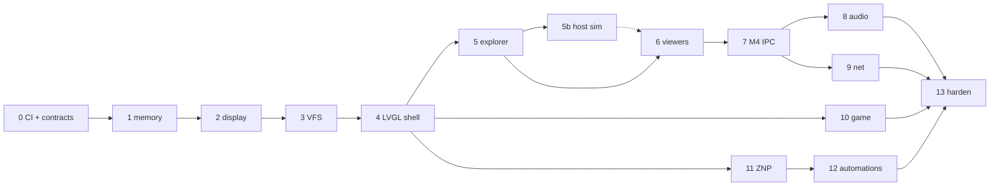
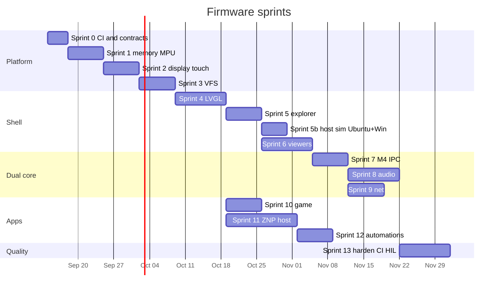

# Development Plan

HMI firmware for STM32H745I-DISCO. Architecture and portability rules are in `Architecture.md`. UI screens are in `UI_Design.md`. Requirements and tests are in `Requirements_and_Test_Cases.md`. CI/CD is in `CICD.md`.

## 1. Product intent

A small dual-core handheld-style shell on the 4.3" panel:

- Launcher
- File explorer, image viewer, text viewer
- Audio player
- **Game** (first title: Brick)
- **Home** (TI ZNP Zigbee host: network, device list, local automations)
- Status (time, storage, Ethernet, Zigbee radio; optional Wi-Fi)

Game and Home use the same `ui_app_t` contract as Files. Game logic is a host-testable sim. Home UI talks only to `home_*`; the Zigbee radio is a TI ZNP on UART, with `zb_host` + `auto_*` on the STM32.

## 2. Non-goals (this generation)

- TouchGFX UI.
- Writing a custom GPU toolkit.
- Linux / MPU migration.
- Full POSIX or a network file server.
- littlefs (or any second user-visible filesystem). The explorer volume stays FAT.
- USB MSC as always-on gadget (it is **in-scope later**, exclusive / opt-in — see Later — USB MSC).
- Treating ESP32 or TI ZNP as on-board hardware (both are UART expansions).
- A 3D / GPU game engine, or Home Assistant / zigbee2mqtt running **on** the STM32.
- Binding Home UI to MQTT or HA dashboards as the primary control path.
- A Matter/Thread stack, or a full Linux Zigbee gateway, on this MCU.

## 3. Platform choices

| Concern | Now | Later |
| --- | --- | --- |
| RTOS | FreeRTOS on each core (M7 first) | Zephyr |
| UI | LVGL over `disp_*` / `input_*` | LVGL on Zephyr |
| Host UI sim | none (logic-only `host-tests`) | SDL2 window on **Ubuntu and Windows** (Sprint 5b) |
| FS | FatFs (FAT) on eMMC behind `vfs_*` | Same FAT volume (Zephyr FAT or FatFs). No littlefs |
| USB MSC | Out until a later sprint | TinyUSB device MSC; exclusive with FatFs |
| IPC | SRAM4 rings + HSEM | OpenAMP / RPMsg |
| Net | LwIP on a single core | Zephyr net |
| Home | `home_*` + `zb_host` + TI ZNP UART + `auto_*` | Same host; Zephyr `uart` only |
| Game | `game_sim` + `gfx_*` | Same modules; gfx via Zephyr display |
| Wi-Fi | Optional ESP32 AT/SPI driver | Same `net_*` API |
| Build | CMake + STM32Cube HAL in `port/cube` | `west` + DTS |
| Cube package | Component repos only (HAL/LL, ft5336, …) | Zephyr DTS; ST components dropped |

**Vendor rule:** write our Discovery BSP; do not submodule [STM32CubeH7](https://github.com/STMicroelectronics/STM32CubeH7) or `stm32h745i-disco-bsp`. Pull chip drivers and upstream middleware per sprint — see `Architecture.md` §3.1 and `third_party/README.md`.

M7-only is acceptable through Sprint 5. M4 starts when audio or offloaded net lands.

## 4. Sprints

Each sprint has a demo on hardware or a host-test gate. Do not start the next sprint until the exit check passes.

Dates are indicative; the dependency graph is normative. Game and ZNP may overlap after the shell exists. Sprint 5b (PC window) may overlap Sprint 6; it does not block viewers on hardware.

### Sprint 0 — Repo, contracts, CI (1–3 days)

- CMake skeleton: `m7`, `host-tests`.
- Empty headers for OSAL, VFS, disp, input, IPC messages.
- UART3 log, assert, reset reason.
- GitHub Actions `ci.yml` as specified in `CICD.md`: format, layering grep, host-tests job, ARM GCC hello.
- `.clang-format`, `scripts/ci/check-layering.sh`.
- **Exit:** host build of `tests/host` runs on PC; M7 blinks LED and prints over VCP; a PR cannot merge if layering or format fails.

### Sprint 1 — Clocks, memory, MPU

Status: **done** (host-tested walking/MPU map; board boot log is the HIL check).

- M7 clock 480 MHz via STM32Cube HAL (`HAL_RCC_*`, VOS0 / SMPS 1.8 V supplies LDO), MPU regions (`HAL_MPU_*`), cache via CMSIS. USART3 console and LED GPIO use the LL driver from the same [`stm32h7xx-hal-driver`](https://github.com/STMicroelectronics/stm32h7xx-hal-driver) package.
- SDRAM init at `0xD0000000` (8 MB, 16-bit FMC bank 2).
- QSPI memory-map at `0x90000000` (read; dual-flash pins, bank-1 1-1-1 smoke). Blank NOR is `0xFF` — do not execute it; true XiP comes with programmed assets.
- SRAM4 reserved and marked non-cacheable, no-execute.
- **Exit:** walking-bit test on SDRAM; QSPI READ ID + mmap read without bus fault; MPU 32-byte no-access fault harness (skip stacked PC).

### Sprint 2 — Display and touch BSP

Status: **done** (host-tested clip/RGB565; board boot log is the HIL check).

- LTDC RGB565, double framebuffer in SDRAM, DMA2D fill/copy — our BSP + HAL, not `BSP_LCD_*`.
- Submodule ST components `stm32-rk043fn48h` (panel timings) and `stm32-ft5336` (touch). I2C4 bus mutex in our BSP.
- `disp_flush` + `input_poll` only; no LVGL yet. Reload and touch INT are polled (no extra IRQs).
- **Exit:** color bars, touch crosshair, ≥ 30 FPS full-screen fill.

### Sprint 3 — Storage VFS

Status: **done** (host-tested jail, extension dispatch, RAM VFS dir walk; board boot log is the HIL check).

- SDMMC1 + FatFs R0.15b behind `vfs_*`. `diskio` is our BSP (polling + IDMA bounce in AXI SRAM).
- Mount `/user` on eMMC; reject path escape (`..`, absolute outside jail).
- Directory listing, sequential read benchmark (`/user/s3.bin`).
- **Exit:** host tests for path jail and extension dispatch; HIL sequential read ≥ 15 MB/s on large files (see REQ-STG-02).

### Sprint 4 — LVGL shell

Status: **done** (host-tested nav stack, launcher geometry, stub registry; board boot log is the HIL check).

- LVGL v9.5.0 ported **only** in `ui/backend_lvgl`.
- Theme tokens, 32 px status bar, launcher grid, navigation stack.
- Dummy apps that push/pop screens (Files stub with a scroll list, Game/Home/Music/Network/Settings stubs).
- Launcher 3×2: Files, Home, Game, Music, Network, Settings.
- **Exit:** launcher opens and returns from two stub apps; 20 FPS UI with touch scroll.

### Sprint 5 — File explorer

Status: **done** (host-tested listing, open-with, Back restores scroll).

- List of `/user` with breadcrumb cwd, empty / unmounted / IO / unknown-type prompt.
- Open-with: `.txt/.md/.c/.h/.log` → text, `.jpg/.jpeg/.png/.bmp` → image, `.mp3/.wav` → player.
- No `..` row; Back leaves the folder. Unknown files: Properties + “Open as text?”.
- **Exit:** browse nested folders, open a file into a stub viewer, Back restores list position.

### Sprint 5b — Host LVGL simulator (Ubuntu + Windows)

Status: **done** (SDL2 window on Ubuntu; Windows link is a CI gate).

Run the same shell on a PC so Files/launcher can be checked without a Discovery board. **Ubuntu and Windows are both first-class.** One backend, not two window toolkits.

Lock:

- **Windowing:** upstream LVGL v9 **SDL2** (`LV_USE_SDL`). Do not add a Win32-only backend, an X11-only backend, or a second widget tree. macOS is nice-to-have if SDL works; it is not an exit gate.
- **Target:** CMake preset `host-sim` → `host_sim`. This is **not** `host-tests`. Unit tests stay LVGL-free (`Architecture.md` §11, `CICD.md`).
- **Code share:** reuse `ui/backend_lvgl/ui_lvgl.c`, `src/shell`, `src/app`. Swap only the port: host `lv_port` + `lv_conf_sim.h` (malloc heap, not `LV_MEM_ADR 0x24010000`). Apps still never include `lvgl.h`.
- **Panel:** 480×272 RGB565. Optional integer scale (2×) so the window is readable on a desktop. Mouse is the pointer (down/move/up in panel space).
- **VFS:** map a host folder to `/user` (jail still applies). Seed tree for demo files. No FatFs, no HAL, no FreeRTOS.
- **Out of sim:** real audio SAI, Ethernet, TI ZNP UART. Those stay stubs or `mock` until their sprints.
- **Deps:** Ubuntu `libsdl2-dev`; Windows SDL2 via vcpkg or CMake `FetchContent`. Document both in README when the sprint lands.
- **CI:** link `host-sim` on GitHub `ubuntu-24.04` **and** `windows-latest`. A display is not required in CI (no xvfb gate). Coverage floor does not include LVGL/SDL.

- **Exit:** `cmake --preset host-sim && cmake --build --preset host-sim` produces a windowed binary on Ubuntu and on Windows; launcher opens Files against a host `/user` folder; Back restores the list; layering grep still passes.

### Sprint 6 — Text and image viewers

Status: **done** (host-tested windowed UTF-8 text, SW JPEG/PNG/BMP, error state; JPEG HW is `ERR_UNSUPPORTED` until the HAL JPEG port).

- Text: UTF-8, wrap, windowed read (`TEXT_WIN_MAX` 32 KB; files larger than 256 KB are paged). Invalid bytes become `?`. CRLF/LF/CR are line breaks.
- Image: software JPEG (ChaN TJpgDec), PNG, BMP; contain-fit into 480×200 RGB565. Next/prev in the folder. JPEG hardware codec is tried first and falls back to SW.
- **Exit:** 10 MB log scrolls via windows; 2 MP JPEG downscales (TJpgDec 1/2–1/8 + contain-fit) without allocating a full RGB buffer; corrupt file shows an error and Back returns to Files.

### Sprint 7 — M4 bring-up and IPC

Status: **done** (host-tested lockless wrap/overflow, credits, version, heartbeat watch; HIL: ping-pong RTT and M4 status).

- M4 independent image, HSEM notify (polled), lockless SRAM4 rings.
- `ipc_msg` version check and credit/back-pressure (`ERR_NOSPC`, no overwrite).
- Heartbeat + log relay to M7. Status bar **M4** goes red if the peer is silent > 500 ms.
- **Exit:** host tests for ring wrap and overflow; HIL round-trip < 2 ms; M4 halt is visible in the status bar.

### Sprint 8 — Audio pipeline

- WM8994 + SAI DMA ping-pong on M4.
- Helix (or replacement) MP3 + WAV behind `media_open_audio`.
- Mini-player in the status/now-playing bar; full player screen.
- **Exit:** 44.1 kHz stereo, no audible glitch while scrolling the explorer; pause/resume/volume via IPC.

### Sprint 9 — Network and time

- Ethernet LwIP on **one** core, link LED/status in the bar.
- Document QSPI-bank2 vs ETH pin policy in BSP.
- RTC on the status bar; NTP optional.
- Optional ESP32 failover **only** if hardware is attached (compile-time).
- **Exit:** DHCP or static IP shown; unplug RJ45 updates status < 2 s; if ESP32 enabled, failover within the REQ-NET timeout.

### Sprint 10 — Game

- `game_module_t` host + **Brick** (paddle, bricks, one-finger drag).
- `gfx_*` on a playfield buffer; pause on Back/Home; high score in `/user/game`.
- **Exit:** host tests for collision/score; HIL ≥ 30 FPS; Home button returns to launcher with audio still healthy.

### Sprint 11 — Zigbee host (TI ZNP)

- `uart_*` on USART1 (Arduino); never USART3. Optional ZNP RESET GPIO.
- `znp_mt` framing + SYS version ping; `zb_host` form coordinator, persist `/user/home`.
- Permit join with timeout; ZDO announce → interview → `home_device_t` on screen.
- OnOff / Level commands; attribute reports update the dashboard.
- `mock` backend so UI works without a dongle.
- **Exit:** host tests for MT checksum and device-table jail; HIL: SYS ping, form, join a test OnOff end device, toggle from the panel, reboot keeps the named list.

### Sprint 12 — Local automation + Home polish

- `auto_*` rules: trigger (attr/time), optional condition, action (`home_cmd` or delay).
- Automations list UI; enable/disable; persist `/user/home/rules.bin`.
- Device page: name, room, IEEE, LQI, last-seen, clusters.
- **Exit:** host tests for occupancy→light rule; HIL: join sensor + bulb, rule fires without Ethernet.

### Sprint 13 — Hardening

- Watchdogs on both cores, brown-out, FS remount, OOM UI.
- Settings app (brightness, volume, IP, Zigbee channel/permit-join default).
- HIL pack for the requirement matrix, including game soak and ZNP mock.
- Size budgets and coverage floors as in `CICD.md` (80% line / 60% branch on host-testable C).
- **Exit:** RTM P0/P1 rows green; 8-hour soak (UI + audio + explorer; game 30 min; ZNP mock or radio idle) without leak or deadlock; CI gates all green.

### Later — Zephyr port (not a product sprint yet)

- `osal/zephyr`, DTS for this board, OpenAMP transport, same apps.
- Track as a spike after Sprint 4 so the HAL stays honest.
- `uart_*` / `zb_host` / `auto_*` and game `gfx_*` must survive that spike without app changes.
- `vfs_*` stays a **FAT** volume. Do not retarget `/user` to littlefs.

### Later — USB MSC (not a product sprint yet)

Opt-in **USB file transfer** so a PC can copy photos/music onto the eMMC. Do **not** implement this until a dedicated sprint; Sprint 4+ product work is unchanged.

Lock:

- **Stack:** upstream **TinyUSB** device MSC. Not Cube `USB_Device`.
- **LUN:** the eMMC **FAT** volume (the same partition FatFs mounts). A PC cannot mount littlefs; that is one reason FAT stays.
- **Mode:** exclusive, started from Settings (“USB file transfer”). Not always-on.
- **While connected:** unmount FatFs, stop audio/decode/home flushes, idle the explorer. Never two writers on the same FAT.
- **On unplug:** remount FatFs, drop VFS caches, refresh `/user`.
- **Jail:** MSC exposes the **volume**, not the `/user` jail. The PC can see `/user/home` and can delete anything on that LUN. Document that in Settings copy.
- **Speed:** board USB is OTG FS (~0.8–1 MB/s practical). Convenience, not a fast pipe.
- **Power-loss on FAT:** for small records (`/user/home`, game saves) write `*.tmp` + rename + `f_sync` if needed. eMMC already has FTL; do not add littlefs wear-leveling on top.

## 5. Suggested GUI change (locked for v2)

Replace the v1 left dock (50×272) + 430×242 canvas with:

- Status bar 480×32
- Content 480×240 (launcher or app)
- In-app top bar 480×40 over content
- Now-playing 480×36 only when audio is active

Rationale: 40 px minimum hit targets, more room for lists and images, matches LVGL patterns, no toolkit-specific dock widget to throw away later.

## 6. Risks

| Risk | Mitigation |
| --- | --- |
| SDRAM bandwidth vs LTDC | RGB565, double buffer, DMA2D; measure FPS in Sprint 2 |
| I2C4 contention (touch vs codec) | BSP mutex; never I2C from ISR |
| ETH / QSPI pin mux | Pick one policy; test both XiP and Ethernet |
| FatFS + LVGL on one core | FS work on a worker thread; UI thread never blocks on eMMC |
| USB MSC vs FatFs writers | Exclusive mode: unmount FatFs while the PC owns the LUN |
| littlefs “safer writes” | Rejected: PC MSC needs FAT; eMMC has FTL; use tmp+rename on small records |
| M7 D-cache vs DMA/IPC | Non-cacheable SRAM4; cache API for DMA |
| TouchGFX samples leaking in | Ban TouchGFX in review; LVGL-only backend; no STM32CubeH7 monolith |
| Game in LVGL widgets | Keep `game_sim` + `gfx_*`; LVGL canvas is a backend, not the model |
| Home UI talking MT/MQTT | `home_*` only; `mock` so UI is not blocked on a dongle |
| USART3 stolen for ZNP | Console stays USART3; ZNP on USART1 |
| Permit join left open | UI countdown; auto-close; no join while locked |
| ZNP UART vs LVGL | DMA + worker; offload to M4 if needed |
| Host sim only on Linux | One SDL2 backend; CI links Ubuntu and Windows |
| Sim widgets drift from the board | Same `ui_lvgl.c` + apps/shell; only `lv_port` / `lv_conf` / VFS / tick differ |
| `host-tests` accidentally link LVGL | Keep presets separate; layering + CICD forbid LVGL in unit tests |
| Scope (MQTT export, climate, extra games, NTP, Wi-Fi) | C/P2; do not block Files, Brick, or Zigbee OnOff |

## 7. Deliverables per milestone

| Milestone | Demo |
| --- | --- |
| M1 (Sprint 2) | Touch paint on color bars |
| M2 (Sprint 5) | Browse eMMC and open files |
| M2b (Sprint 5b) | Same shell in an SDL window on Ubuntu and Windows |
| M3 (Sprint 6) | View JPEG + UTF-8 text |
| M4 (Sprint 8) | Play MP3 while browsing |
| M5 (Sprint 10) | Brick playable at ≥ 30 FPS |
| M6 (Sprint 11) | Form Zigbee net, show joined device, toggle OnOff |
| M7 (Sprint 12) | Local rule fires on the panel with no Ethernet |
| M8 (Sprint 13) | Full shell, soak |

## 8. Documentation map

| File | Contents |
| --- | --- |
| `Design_Review.md` | Why v1 changed |
| `Architecture.md` | Layers, memory, interfaces, boot/thread/Zigbee flows |
| `UI_Design.md` | Shell, screens, navigation and pairing flows |
| `Requirements_and_Test_Cases.md` | Shall statements + tests + RTM + CI reqs |
| `CICD.md` | GitHub Actions, static analysis, coverage gates |
| `Plan.md` | This file |
| `third_party/README.md` | CubeH7 vs our BSP vs component submodules |
