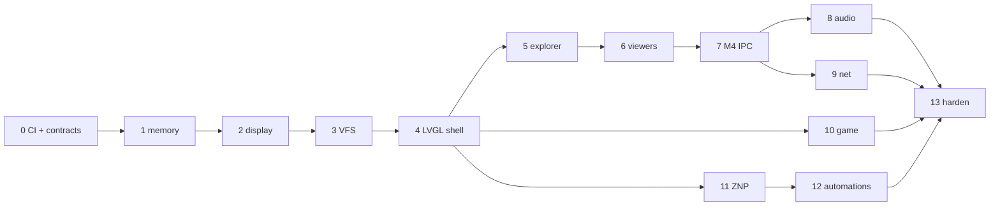
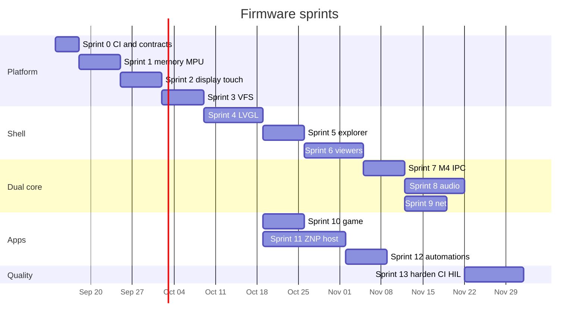

# Development Plan

HMI firmware for STM32H745I-DISCO. Architecture and portability rules are in `Architecture.md`. UI screens are in `UI_Design.md`. Requirements and tests are in `Requirements_and_Test_Cases.md`. CI/CD is in `CICD.md`.

## 1. Product intent

A small dual-core handheld-style shell on the 4.3" panel:

- Launcher
- File explorer, image viewer, text viewer
- Audio player
- **Game** (first title: Brick)
- **Home** (TI ZNP Zigbee host: network, device list, local automations)
- Status (time, storage, Ethernet, Zigbee radio; optional Wi-Fi)

Game and Home use the same `ui_app_t` contract as Files. Game logic is a host-testable sim. Home UI talks only to `home_*`; the Zigbee radio is a TI ZNP on UART, with `zb_host` + `auto_*` on the STM32.

## 2. Non-goals (this generation)

- TouchGFX UI.
- Writing a custom GPU toolkit.
- Linux / MPU migration.
- Full POSIX, USB mass-storage gadget, or network file server.
- Treating ESP32 or TI ZNP as on-board hardware (both are UART expansions).
- A 3D / GPU game engine, or Home Assistant / zigbee2mqtt running **on** the STM32.
- Binding Home UI to MQTT or HA dashboards as the primary control path.
- A Matter/Thread stack, or a full Linux Zigbee gateway, on this MCU.

## 3. Platform choices

| Concern | Now | Later |
| --- | --- | --- |
| RTOS | FreeRTOS on each core (M7 first) | Zephyr |
| UI | LVGL over `disp_*` / `input_*` | LVGL on Zephyr |
| FS | FatFS on eMMC behind `vfs_*` | Zephyr FS |
| IPC | SRAM4 rings + HSEM | OpenAMP / RPMsg |
| Net | LwIP on a single core | Zephyr net |
| Home | `home_*` + `zb_host` + TI ZNP UART + `auto_*` | Same host; Zephyr `uart` only |
| Game | `game_sim` + `gfx_*` | Same modules; gfx via Zephyr display |
| Wi-Fi | Optional ESP32 AT/SPI driver | Same `net_*` API |
| Build | CMake + STM32Cube HAL in `port/cube` | `west` + DTS |

M7-only is acceptable through Sprint 5. M4 starts when audio or offloaded net lands.

## 4. Sprints

Each sprint has a demo on hardware or a host-test gate. Do not start the next sprint until the exit check passes.

Dates are indicative; the dependency graph is normative. Game and ZNP may overlap after the shell exists.

### Sprint 0 — Repo, contracts, CI (1–3 days)

- CMake skeleton: `m7`, `host-tests`.
- Empty headers for OSAL, VFS, disp, input, IPC messages.
- UART3 log, assert, reset reason.
- GitHub Actions `ci.yml` as specified in `CICD.md`: format, layering grep, host-tests job, ARM GCC hello.
- `.clang-format`, `scripts/ci/check-layering.sh`.
- **Exit:** host build of `tests/host` runs on PC; M7 blinks LED and prints over VCP; a PR cannot merge if layering or format fails.

### Sprint 1 — Clocks, memory, MPU

Status: **done** (host-tested walking/MPU map; board boot log is the HIL check).

- M7 clock 480 MHz via STM32Cube HAL (`HAL_RCC_*`, VOS0 / SMPS 1.8 V supplies LDO), MPU regions (`HAL_MPU_*`), cache via CMSIS. USART3 console and LED GPIO use the LL driver from the same [`stm32h7xx-hal-driver`](https://github.com/STMicroelectronics/stm32h7xx-hal-driver) package.
- SDRAM init at `0xD0000000` (8 MB, 16-bit FMC bank 2).
- QSPI memory-map at `0x90000000` (read; dual-flash pins, bank-1 1-1-1 smoke). Blank NOR is `0xFF` — do not execute it; true XiP comes with programmed assets.
- SRAM4 reserved and marked non-cacheable, no-execute.
- **Exit:** walking-bit test on SDRAM; QSPI READ ID + mmap read without bus fault; MPU 32-byte no-access fault harness (skip stacked PC).

### Sprint 2 — Display and touch BSP

- LTDC RGB565, double framebuffer in SDRAM, DMA2D fill/copy.
- Backlight, display on, FT5336 on I2C4 with bus mutex.
- `disp_flush` + `input_poll` only; no LVGL yet.
- **Exit:** color bars, touch crosshair, ≥ 30 FPS full-screen fill.

### Sprint 3 — Storage VFS

- SDMMC1 + FatFS (or equivalent) behind `vfs_*`.
- Mount `/user` on eMMC; reject path escape (`..`, absolute outside jail).
- Directory listing, sequential read benchmark.
- **Exit:** host tests for path jail and extension dispatch; HIL sequential read ≥ 15 MB/s on large files (see REQ-STG-02).

### Sprint 4 — LVGL shell

- LVGL ported **only** in `ui/backend_lvgl`.
- Theme tokens, 32 px status bar, launcher grid, navigation stack.
- Dummy apps that push/pop screens (Files stub, Game stub, Home stub).
- Launcher 3×2: Files, Home, Game, Music, Network, Settings.
- **Exit:** launcher opens and returns from two stub apps; 20 FPS UI with touch scroll.

### Sprint 5 — File explorer

- List/grid of `/user`, breadcrumbs, empty and error states.
- Open-with registry: `.txt/.md/.c/.h` → text, `.jpg/.jpeg/.png/.bmp` → image, `.mp3/.wav` → player.
- **Exit:** browse nested folders, open a file into a stub viewer, Back returns with list position restored.

### Sprint 6 — Text and image viewers

- Text: UTF-8, wrap, windowed read (do not load huge files).
- Image: JPEG HW codec when possible, SW PNG/BMP, fit-to-screen, pan, next/prev in folder.
- **Exit:** 10 MB log scrolls; 2 MP JPEG downscales without killing the shell; corrupt file shows an error modal.

### Sprint 7 — M4 bring-up and IPC

- M4 independent image, HSEM notify, lockless rings.
- `ipc_msg` version check and credit/back-pressure.
- Heartbeat + log relay to M7.
- **Exit:** host tests for ring wrap and overflow; HIL round-trip < 2 ms; M4 halt is visible in the status bar.

### Sprint 8 — Audio pipeline

- WM8994 + SAI DMA ping-pong on M4.
- Helix (or replacement) MP3 + WAV behind `media_open_audio`.
- Mini-player in the status/now-playing bar; full player screen.
- **Exit:** 44.1 kHz stereo, no audible glitch while scrolling the explorer; pause/resume/volume via IPC.

### Sprint 9 — Network and time

- Ethernet LwIP on **one** core, link LED/status in the bar.
- Document QSPI-bank2 vs ETH pin policy in BSP.
- RTC on the status bar; NTP optional.
- Optional ESP32 failover **only** if hardware is attached (compile-time).
- **Exit:** DHCP or static IP shown; unplug RJ45 updates status < 2 s; if ESP32 enabled, failover within the REQ-NET timeout.

### Sprint 10 — Game

- `game_module_t` host + **Brick** (paddle, bricks, one-finger drag).
- `gfx_*` on a playfield buffer; pause on Back/Home; high score in `/user/game`.
- **Exit:** host tests for collision/score; HIL ≥ 30 FPS; Home button returns to launcher with audio still healthy.

### Sprint 11 — Zigbee host (TI ZNP)

- `uart_*` on USART1 (Arduino); never USART3. Optional ZNP RESET GPIO.
- `znp_mt` framing + SYS version ping; `zb_host` form coordinator, persist `/user/home`.
- Permit join with timeout; ZDO announce → interview → `home_device_t` on screen.
- OnOff / Level commands; attribute reports update the dashboard.
- `mock` backend so UI works without a dongle.
- **Exit:** host tests for MT checksum and device-table jail; HIL: SYS ping, form, join a test OnOff end device, toggle from the panel, reboot keeps the named list.

### Sprint 12 — Local automation + Home polish

- `auto_*` rules: trigger (attr/time), optional condition, action (`home_cmd` or delay).
- Automations list UI; enable/disable; persist `/user/home/rules.bin`.
- Device page: name, room, IEEE, LQI, last-seen, clusters.
- **Exit:** host tests for occupancy→light rule; HIL: join sensor + bulb, rule fires without Ethernet.

### Sprint 13 — Hardening

- Watchdogs on both cores, brown-out, FS remount, OOM UI.
- Settings app (brightness, volume, IP, Zigbee channel/permit-join default).
- HIL pack for the requirement matrix, including game soak and ZNP mock.
- Size budgets and coverage floors as in `CICD.md` (80% line / 60% branch on host-testable C).
- **Exit:** RTM P0/P1 rows green; 8-hour soak (UI + audio + explorer; game 30 min; ZNP mock or radio idle) without leak or deadlock; CI gates all green.

### Later — Zephyr port (not a product sprint yet)

- `osal/zephyr`, DTS for this board, OpenAMP transport, same apps.
- Track as a spike after Sprint 4 so the HAL stays honest.
- `uart_*` / `zb_host` / `auto_*` and game `gfx_*` must survive that spike without app changes.

## 5. Suggested GUI change (locked for v2)

Replace the v1 left dock (50×272) + 430×242 canvas with:

- Status bar 480×32
- Content 480×240 (launcher or app)
- In-app top bar 480×40 over content
- Now-playing 480×36 only when audio is active

Rationale: 40 px minimum hit targets, more room for lists and images, matches LVGL patterns, no toolkit-specific dock widget to throw away later.

## 6. Risks

| Risk | Mitigation |
| --- | --- |
| SDRAM bandwidth vs LTDC | RGB565, double buffer, DMA2D; measure FPS in Sprint 2 |
| I2C4 contention (touch vs codec) | BSP mutex; never I2C from ISR |
| ETH / QSPI pin mux | Pick one policy; test both XiP and Ethernet |
| FatFS + LVGL on one core | FS work on a worker thread; UI thread never blocks on eMMC |
| M7 D-cache vs DMA/IPC | Non-cacheable SRAM4; cache API for DMA |
| TouchGFX samples leaking in | Ban TouchGFX in review; LVGL-only backend |
| Game in LVGL widgets | Keep `game_sim` + `gfx_*`; LVGL canvas is a backend, not the model |
| Home UI talking MT/MQTT | `home_*` only; `mock` so UI is not blocked on a dongle |
| USART3 stolen for ZNP | Console stays USART3; ZNP on USART1 |
| Permit join left open | UI countdown; auto-close; no join while locked |
| ZNP UART vs LVGL | DMA + worker; offload to M4 if needed |
| Scope (MQTT export, climate, extra games, NTP, Wi-Fi) | C/P2; do not block Files, Brick, or Zigbee OnOff |

## 7. Deliverables per milestone

| Milestone | Demo |
| --- | --- |
| M1 (Sprint 2) | Touch paint on color bars |
| M2 (Sprint 5) | Browse eMMC and open files |
| M3 (Sprint 6) | View JPEG + UTF-8 text |
| M4 (Sprint 8) | Play MP3 while browsing |
| M5 (Sprint 10) | Brick playable at ≥ 30 FPS |
| M6 (Sprint 11) | Form Zigbee net, show joined device, toggle OnOff |
| M7 (Sprint 12) | Local rule fires on the panel with no Ethernet |
| M8 (Sprint 13) | Full shell, soak |

## 8. Documentation map

| File | Contents |
| --- | --- |
| `Design_Review.md` | Why v1 changed |
| `Architecture.md` | Layers, memory, interfaces, boot/thread/Zigbee flows |
| `UI_Design.md` | Shell, screens, navigation and pairing flows |
| `Requirements_and_Test_Cases.md` | Shall statements + tests + RTM + CI reqs |
| `CICD.md` | GitHub Actions, static analysis, coverage gates |
| `Plan.md` | This file |
