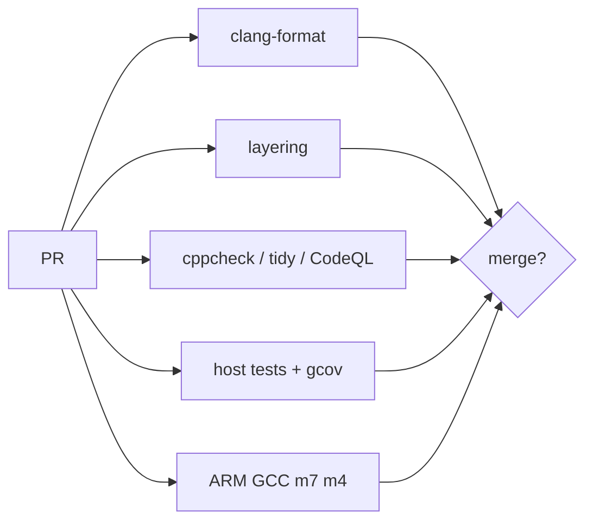

# Requirements and Test Cases

Scope: STM32H745I-DISCO HMI described in `Architecture.md` and `UI_Design.md`.

**Priority:** M = Must (P0), S = Should (P1), C = Could (P2).

**Verification:** UT = host unit test, IT = on-target integration, HIL = hardware-in-the-loop with timing/instruments, INSP = review.

IDs are stable. Do not reuse a retired ID.

---

## 1. System and portability

| ID | Pri | Requirement | Verify |
| --- | --- | --- | --- |
| REQ-SYS-01 | M | The product shall run on STM32H745I-DISCO with a 480×272 panel. | INSP, HIL |
| REQ-SYS-02 | M | Application sources under `src/app` and `src/shell` shall not include LVGL, TouchGFX, FreeRTOS, Zephyr, FatFS, or STM32 HAL headers. | UT (include-guard / grep CI) |
| REQ-SYS-03 | M | OS services shall be used only through `osal_*`. | INSP, UT |
| REQ-SYS-04 | M | Filesystem access from apps shall use `vfs_*` only. | INSP, UT |
| REQ-SYS-05 | M | Display and touch shall be used by the UI backend only through `disp_*` and `input_*`. | INSP |
| REQ-SYS-06 | S | A second OSAL port (Zephyr) shall be addable without changing app source. | INSP |
| REQ-SYS-07 | M | Both cores shall service a watchdog within the configured period once enabled. | HIL |
| REQ-SYS-08 | S | Firmware shall log on USART3 at 115200 8N1 with core and module tags. | IT |

### Tests

**TC-SYS-01 (UT) — Layering**  
GIVEN the firmware tree  
WHEN CI scans `src/app` and `src/shell` includes  
THEN no forbidden headers are listed.

**TC-SYS-02 (HIL) — Bring-up**  
GIVEN a programmed Discovery board  
WHEN reset is released  
THEN VCP shows M7 banner within 2 s and the panel leaves the reset splash for the launcher.

**TC-SYS-03 (HIL) — Watchdog**  
GIVEN watchdogs enabled  
WHEN the UI thread is deliberately stalled past the timeout in a debug build  
THEN the system resets and Backup SRAM records the reason.

---

## 2. Memory and cache

| ID | Pri | Requirement | Verify |
| --- | --- | --- | --- |
| REQ-MEM-01 | M | Framebuffers shall reside in SDRAM at `0xD0000000` and shall not exceed the 8 MB usable window. | INSP, IT |
| REQ-MEM-02 | M | SRAM4 at `0x38000000` shall be mapped non-cacheable (or Device) and reserved for IPC. | INSP, UT |
| REQ-MEM-03 | M | DMA buffers shared with peripherals shall be aligned and either non-cacheable or maintained with `bsp_cache_*`. | INSP, HIL |
| REQ-MEM-04 | M | QSPI shall be memory-mapped for read-only assets before UI start. | IT |
| REQ-MEM-05 | S | M7 hot paths may be placed in ITCM; M4 shall not use SDRAM. | INSP |

### Tests

**TC-MEM-01 (IT) — SDRAM**  
Walking 1s / 0s over 8 MB; fail on mismatch.

**TC-MEM-02 (UT) — IPC region**  
Linker symbols for SRAM4 rings lie inside `0x38000000`–`0x38010000` and do not overlap.

**TC-MEM-03 (HIL) — Cache**  
M7 writes a DMA/IPC payload, issues the documented cache op (or uses non-cacheable memory), M4 reads expected bytes.

---

## 3. Inter-core IPC

| ID | Pri | Requirement | Verify |
| --- | --- | --- | --- |
| REQ-IPC-01 | M | Cores shall exchange versioned messages with a fixed header (magic, version, type, seq, length). Payloads shall contain no pointers. | UT |
| REQ-IPC-02 | M | The first transport shall be lockless rings in SRAM4 plus HSEM notification. | IT |
| REQ-IPC-03 | M | Control-message round-trip latency shall be ≤ 2 ms under idle UI. | HIL |
| REQ-IPC-04 | M | A full ring shall fail send with an error and shall not overwrite unread messages. | UT |
| REQ-IPC-05 | M | If M4 stops heartbeating for > 500 ms, M7 shall show a degraded status and shall not deadlock the UI. | HIL |
| REQ-IPC-06 | S | Transport shall be replaceable with OpenAMP without changing `ipc_msg.h` or apps. | INSP |

### Tests

**TC-IPC-01 (UT) — Wrap**  
Push N+1 messages of size S into a ring of capacity N; expect overflow error; pop N; contents match first N.

**TC-IPC-02 (UT) — Framing**  
Truncated and bad-magic headers are rejected; seq monotonic.

**TC-IPC-03 (HIL) — Latency**  
1000 ping-pongs; p99 ≤ 2 ms (DWT cycle counter).

**TC-IPC-04 (HIL) — M4 halt**  
Halt M4 in debug; status bar shows M4 error within 1 s; launcher still navigable.

---

## 4. Storage and VFS

| ID | Pri | Requirement | Verify |
| --- | --- | --- | --- |
| REQ-STG-01 | M | The system shall mount a FAT filesystem on the on-board 4 GB eMMC via SDMMC. The user-visible volume shall remain FAT; littlefs shall not be used. | HIL, INSP |
| REQ-STG-02 | S | Sequential reads of a ≥ 64 MB file shall sustain ≥ 15 MB/s average. | HIL |
| REQ-STG-03 | M | Apps shall see a jailed tree rooted at `/user`. Paths containing `..` or extra `/` that escape the jail shall be rejected. | UT |
| REQ-STG-04 | M | VFS shall report mount failure without crashing; UI shall show Retry. | HIL |
| REQ-STG-05 | M | Directory iteration shall be incremental (no requirement to load the whole directory into AXI SRAM). | UT, IT |
| REQ-STG-06 | S | QSPI assets shall not be writable through the explorer. | UT, IT |
| REQ-STG-07 | C | The device shall present the eMMC FAT volume as a USB MSC LUN when the user enables USB file transfer. Stack: TinyUSB, not Cube USB. | HIL |
| REQ-STG-08 | C | While USB MSC is active the firmware shall not keep FatFs mounted on that volume. On host unplug it shall remount and drop VFS caches. | HIL |

### Tests

**TC-STG-01 (UT) — Jail**  
`/user/../user/x`, `/user/foo/../../etc`, `//user`, NUL in path → rejected; `/user/a/b.txt` → accepted.

**TC-STG-02 (UT) — Dispatch**  
`.mp3 .wav` → audio; `.jpg .jpeg .png .bmp` → image; `.txt .md .c .h .log` → text; unknown → none.

**TC-STG-03 (HIL) — Mount**  
Boot with valid FAT; `/user` lists. Boot with corrupted MBR; error screen, Retry.

**TC-STG-04 (HIL) — Throughput**  
Read 64 MB file, TIM/DWT elapsed; average ≥ 15 MB/s. Record in the test log even if S-priority is waived on a given board.

**TC-STG-05 (HIL) — USB MSC exclusive** (when REQ-STG-07/08 are implemented)  
Enable USB file transfer; PC mounts the FAT volume; explorer shows storage busy. Unplug; `/user` lists again. Firmware must not write the volume while the PC is mounted.

---

## 5. UI shell

| ID | Pri | Requirement | Verify |
| --- | --- | --- | --- |
| REQ-UI-01 | M | The panel shall use RGB565 (default) at 480×272 with double buffering. | IT |
| REQ-UI-02 | M | A 32 px status bar shall remain visible on all screens. | IT |
| REQ-UI-03 | M | Interactive controls shall be at least 40×40 px. | INSP |
| REQ-UI-04 | M | The launcher shall open registered apps and Back shall return to the launcher. | HIL |
| REQ-UI-05 | M | The UI thread shall not call blocking VFS or decode APIs. | UT, INSP |
| REQ-UI-06 | S | List scrolling shall maintain ≥ 20 FPS. | HIL |
| REQ-UI-07 | M | Touch down/move/up shall be delivered with coordinates in panel space. | HIL |
| REQ-UI-08 | S | User button shall return to the launcher. | HIL |
| REQ-UI-09 | M | Errors shall use a modal with human-readable text, never a blank screen or HAL assert in production builds. | HIL |
| REQ-SIM-01 | S | A PC simulator shall run the LVGL shell in a 480×272 (or integer-scaled) window on Ubuntu and Windows using SDL2. | UT, INSP |
| REQ-SIM-02 | S | The simulator shall use the same `src/app` and `src/shell` as firmware. Apps shall not include LVGL. | INSP |
| REQ-SIM-03 | S | CI shall link the `host-sim` target on Ubuntu and Windows. A display is not required in CI. | UT |

### Tests

**TC-UI-01 (HIL) — Nav**  
Launcher → Files → Back → Launcher; coordinates of tiles register within 8 px of center.

**TC-UI-02 (HIL) — FPS**  
Scroll a 200-row dummy list; frame counter ≥ 20 FPS over 3 s.

**TC-UI-03 (UT) — Non-blocking**  
UI tick unit test fails the build if a stub VFS that sleeps is invoked on the UI thread.

**TC-SIM-01 (UT)**  
`cmake --preset host-sim && cmake --build --preset host-sim` succeeds on Ubuntu 24.04 and on Windows (MSVC or MinGW) with SDL2 available.

**TC-SIM-02 (INSP)**  
`host-tests` does not link LVGL or SDL. `host-sim` does not include `lvgl.h` from `src/app` or `src/shell`.

---

## 6. File explorer

| ID | Pri | Requirement | Verify |
| --- | --- | --- | --- |
| REQ-FE-01 | M | The explorer shall list directories and files under `/user` with name and type icon. | HIL |
| REQ-FE-02 | M | Tapping a directory shall open it; Back shall restore parent, scroll offset, and selection. | HIL |
| REQ-FE-03 | M | Tapping a file shall open the registered viewer or a Properties + fallback dialog. | HIL |
| REQ-FE-04 | M | Empty and error states shall be distinct. | HIL |
| REQ-FE-05 | S | A grid view shall be available for folders that contain images. | HIL |
| REQ-FE-06 | C | Rename and delete shall require confirmation. | HIL |

### Tests

**TC-FE-01 (HIL)**  
Fixture tree `/user/a/b/c.txt`. Navigate to `c.txt`, Back twice, first-level names still visible, previous scroll restored.

**TC-FE-02 (HIL)**  
Empty folder shows empty state; folder with 1 file does not.

**TC-FE-03 (UT)**  
Open-with table as in TC-STG-02.

---

## 7. Image viewer

| ID | Pri | Requirement | Verify |
| --- | --- | --- | --- |
| REQ-IMG-01 | M | The viewer shall display JPEG, PNG, and BMP from VFS. | HIL |
| REQ-IMG-02 | M | Images larger than the decode buffer shall be downscaled to fit the buffer and then shown with contain-fit. | HIL |
| REQ-IMG-03 | M | JPEG shall use the STM32 JPEG hardware codec when available, with a software fallback path compiled for host tests. | UT, HIL |
| REQ-IMG-04 | M | A corrupt or truncated image shall show an error and leave the explorer usable. | HIL |
| REQ-IMG-05 | S | Swipe or next/prev controls shall move among images in the same folder. | HIL |
| REQ-IMG-06 | S | Pan when zoomed; double-tap toggles fit and 1:1 (if 1:1 fits memory). | HIL |
| REQ-IMG-07 | S | Decode shall run off the UI thread with a busy indicator. | IT |

### Tests

**TC-IMG-01 (HIL)**  
Open 480×272 JPEG, 1920×1080 JPEG, 100×100 PNG, 24-bit BMP; all render.

**TC-IMG-02 (HIL)**  
Open truncated JPEG; modal error; Back to list.

**TC-IMG-03 (UT)**  
Software decoder on PC for a golden JPEG; pixel checksum of a 16×16 center crop.

**TC-IMG-04 (HIL)**  
Next/prev skips `notes.txt` in a mixed folder.

---

## 8. Text viewer

| ID | Pri | Requirement | Verify |
| --- | --- | --- | --- |
| REQ-TXT-01 | M | The viewer shall show UTF-8 text with word wrap. | HIL |
| REQ-TXT-02 | M | Files larger than 256 KB shall be read in windows; peak RAM for the text buffer shall be bounded in documentation and enforced by a constant. | UT, IT |
| REQ-TXT-03 | M | CRLF and LF shall display as line breaks. | UT |
| REQ-TXT-04 | S | Font size shall be adjustable (at least two steps). | HIL |
| REQ-TXT-05 | M | Invalid UTF-8 shall be replaced, not abort. | UT |
| REQ-TXT-06 | C | Markdown styling for `.md`. | HIL |

### Tests

**TC-TXT-01 (UT)**  
Windowed reader over a 1 MB generated file; only one window resident; random seek to 90% shows the expected line prefix.

**TC-TXT-02 (UT)**  
Invalid UTF-8 sequence becomes U+FFFD or `?`; function returns OK.

**TC-TXT-03 (HIL)**  
Open `/user/notes/utf8.txt` (English + Vietnamese); wrap at 480 px; scroll to end.

---

## 9. Audio

| ID | Pri | Requirement | Verify |
| --- | --- | --- | --- |
| REQ-AUD-01 | M | The system shall output 16-bit stereo PCM on the WM8994 via SAI DMA in a ping-pong buffer. | HIL |
| REQ-AUD-02 | M | MP3 and WAV playback shall be available through `media_*` + IPC to M4. | HIL |
| REQ-AUD-03 | M | Play, pause, resume, and volume shall not block the UI thread. | HIL |
| REQ-AUD-04 | M | Audio shall continue while the explorer is scrolled (no audible underrun in a quiet room at 44.1 kHz). | HIL |
| REQ-AUD-05 | S | A mini-player shall appear while audio is active. | HIL |
| REQ-AUD-06 | S | Mixer/clipping shall be unit-tested on host. | UT |

### Tests

**TC-AUD-01 (UT)**  
Mixer clip: sum of two full-scale sines never exceeds int16; zero input → zero output.

**TC-AUD-02 (HIL)**  
Play 30 s MP3; pause at 10 s; resume; headphones hear continuity.

**TC-AUD-03 (HIL)**  
Play WAV; scroll explorer for 10 s; flag underrun counter remains 0.

**TC-AUD-04 (HIL)**  
Volume IPC 0…100 maps to codec without I2C bus lockup (touch still works).

---

## 10. Network and time

| ID | Pri | Requirement | Verify |
| --- | --- | --- | --- |
| REQ-NET-01 | M | Ethernet link up/down shall be reflected on the status bar within 2 s. | HIL |
| REQ-NET-02 | S | The device shall obtain IPv4 via DHCP or use a stored static address. | HIL |
| REQ-NET-03 | C | If an ESP32 expansion is compiled in, loss of Ethernet shall fail over to Wi-Fi within 10 s. | HIL |
| REQ-NET-04 | M | Network shall be initialized on exactly one core. | INSP, IT |
| REQ-NET-05 | M | Status bar shall show RTC time after boot (NTP is not required for M). | HIL |
| REQ-NET-06 | C | NTP shall set RTC when a server is reachable. | HIL |

### Tests

**TC-NET-01 (HIL)**  
Unplug RJ45 under ping; icon goes `err` in ≤ 2 s.

**TC-NET-02 (HIL)**  
DHCP lease displayed on Network screen.

**TC-NET-03 (HIL, optional hardware)**  
Ethernet unplug with ESP32 present; Wi-Fi carries ICMP within 10 s.

---

## 11. Game

| ID | Pri | Requirement | Verify |
| --- | --- | --- | --- |
| REQ-GAME-01 | S | The launcher shall provide a Game app that loads at least the Brick module. | HIL |
| REQ-GAME-02 | S | Game simulation shall live in `game_sim` / `game_module_t` with no LVGL, FreeRTOS, or HAL includes. | UT |
| REQ-GAME-03 | S | Drawing shall go through `gfx_*` (clear/fill/blit), not one UI widget per sprite. | INSP, UT |
| REQ-GAME-04 | S | Brick shall play at ≥ 30 FPS on the Discovery panel in RGB565. | HIL |
| REQ-GAME-05 | S | Paddle control shall use a ≥ 40 px-tall drag band; Back or Home shall pause or quit without crashing the shell. | HIL |
| REQ-GAME-06 | S | High score shall persist in `/user/game` across reset when eMMC is mounted. | HIL |
| REQ-GAME-07 | S | A second game module shall be addable without changing the shell. | INSP |
| REQ-GAME-08 | C | Audio playback shall continue during Brick without SAI underrun. | HIL |

### Tests

**TC-GAME-01 (UT)**  
Brick: reset; tick with no input; ball position changes; brick-ball overlap increments score and removes brick; ball below playfield decrements lives.

**TC-GAME-02 (UT)**  
`gfx` spy: one frame after reset records a clear and at least one paddle fill; no LVGL symbols linked.

**TC-GAME-03 (HIL)**  
Play 15 s; frame counter ≥ 30 FPS; drag paddle; Back shows pause; Resume continues; Home returns to launcher.

**TC-GAME-04 (HIL)**  
Beat a previous high score; reboot; Game shows the stored high score.

---

## 12. Home automation (Zigbee host)

| ID | Pri | Requirement | Verify |
| --- | --- | --- | --- |
| REQ-HOME-01 | S | Apps shall access devices only through `home_*` (no MT, UART HAL, MQTT, or lwIP types in `src/app`). | UT |
| REQ-HOME-02 | S | A `mock` backend shall provide ≥ 2 rooms and ≥ 4 devices so the UI runs with no ZNP dongle. | UT, HIL |
| REQ-HOME-03 | S | The Devices screen shall list Zigbee devices with icon, name, primary state, and LQI or last-seen. Lights and switches shall have ≥ 40 px toggles; binary sensors shall be read-only. | HIL |
| REQ-HOME-04 | S | `home_cmd` on/off (OnOff cluster) shall update the model; UI is optimistic and reverts on failure. | UT, HIL |
| REQ-HOME-05 | S | If ZNP UART is down, the UI shall show “Radio not ready” and the last-known list without crashing. | HIL |
| REQ-HOME-06 | S | The service shall support at least 8 rooms and 32 devices in RAM. | UT |
| REQ-HOME-07 | S | The host shall talk to a TI ZNP over `uart_*` (default USART1). USART3 shall remain the console. | INSP, HIL |
| REQ-HOME-08 | S | After ZDO end-device announce, the host shall interview endpoints/simple descriptors and map clusters to `home_kind_t`. | UT, HIL |
| REQ-HOME-09 | C | Climate setpoint and scene buttons (Good night / Away). | HIL |
| REQ-HOME-10 | S | MT UART, interview, and `home_cmd` shall not run on the UI thread. | UT, INSP |
| REQ-HOME-11 | S | The user shall form a coordinator network and open permit-join for a bounded time (60 s or 120 s). Join shall auto-close. | HIL |
| REQ-HOME-12 | S | Device IEEE, NWK, name, room, and last states shall persist in `/user/home` across reset. | HIL |
| REQ-HOME-13 | S | Local automations (`auto_*`) shall run on the STM32: a trigger on a device attribute shall execute `home_cmd` without Ethernet or a cloud. | UT, HIL |
| REQ-HOME-14 | S | The Device page shall show name, room, IEEE, LQI, last-seen, and cluster controls. | HIL |
| REQ-HOME-15 | C | Optional MQTT export of `home_*` state (not the control path). | HIL |

MQTT Home Assistant discovery (old REQ-HOME-08) is retired; IDs 07–08 now mean ZNP UART and interview.

### Tests

**TC-HOME-01 (UT)**  
Mock: list devices; toggle light; callback fires; failed cmd reverts.

**TC-HOME-02 (UT)**  
Fill 8 rooms × 4 devices (32); 33rd register returns an error.

**TC-HOME-03 (UT)**  
CI scan: `src/app/home` does not include STM32 UART HAL, MT headers, MQTT, or lwIP.

**TC-HOME-04 (HIL)**  
No dongle: Home opens, mock or last-known list, “Radio not ready” if `zb_host` has no SYS ping, no crash.

**TC-HOME-05 (HIL)**  
ZNP on USART1: SYS version; form coordinator; permit join; a test OnOff device appears on the Devices screen; toggle matches the bulb; reboot keeps the name.

**TC-HOME-06 (HIL)**  
Device name and room persist in `/user/home` across reset.

**TC-HOME-07 (UT)**  
MT frame encode/decode: length and FCS mismatch rejected; valid SYS ping round-trip against a UART stub.

**TC-HOME-08 (UT)**  
Interview fixture (OnOff + Level endpoints) maps to `HOME_LIGHT`; IAS Zone maps to `HOME_BINARY_SENSOR`.

**TC-HOME-09 (HIL)**  
Permit join 60 s; countdown visible; after timeout new devices do not join.

**TC-HOME-10 (UT / HIL)**  
Rule: occupancy `occupied` → light On, 3 s delay → Off. Host test with mock reports; HIL with sensor + bulb, Ethernet unplugged.

---

## 13. Time, settings, robustness

| ID | Pri | Requirement | Verify |
| --- | --- | --- | --- |
| REQ-CFG-01 | S | Brightness, volume, and Home names/rooms/rules shall persist across reset. | HIL |
| REQ-CFG-02 | M | About shall show M7 and M4 firmware versions. | IT |
| REQ-RST-01 | M | Hard fault handlers shall log and reset in production; they shall not paint a white screen forever. | HIL |
| REQ-RST-02 | S | eMMC surprise unmount (if reproduced) shall put VFS in error and keep shell alive. | HIL |

---

## 14. Host vs HIL policy

| Kind | Where | What belongs |
| --- | --- | --- |
| UT | PC, CMake `host-tests` | Path jail, IPC rings, UTF-8, dispatcher, mixer math, image golden, include check, **Brick sim**, **home mock**, **MT FCS**, **auto rules** |
| SIM | PC, CMake `host-sim` (Sprint 5b) | Visual shell: launcher + Files on Ubuntu and Windows (SDL2). Link in CI; run locally |
| IT | Board, no extra gear | Mount, display mode, QSPI map, versions |
| HIL | Board + actions | Latency, FPS, failover, audio, throughput, **game FPS**, **ZNP join/toggle** |

Host tests must not link STM32 HAL, LVGL, or SDL. The simulator is a different target.

---

## 15. Traceability (RTM)

| Requirement | Tests |
| --- | --- |
| REQ-SYS-01 | TC-SYS-02 |
| REQ-SYS-02 | TC-SYS-01 |
| REQ-SYS-03 | TC-SYS-01 |
| REQ-SYS-04 | TC-SYS-01, TC-STG-01 |
| REQ-SYS-05 | TC-UI-01 |
| REQ-SYS-06 | INSP |
| REQ-SYS-07 | TC-SYS-03 |
| REQ-SYS-08 | TC-SYS-02 |
| REQ-MEM-01 | TC-MEM-01 |
| REQ-MEM-02 | TC-MEM-02 |
| REQ-MEM-03 | TC-MEM-03 |
| REQ-MEM-04 | TC-SYS-02 |
| REQ-IPC-01 | TC-IPC-02 |
| REQ-IPC-02 | TC-IPC-03 |
| REQ-IPC-03 | TC-IPC-03 |
| REQ-IPC-04 | TC-IPC-01 |
| REQ-IPC-05 | TC-IPC-04 |
| REQ-STG-01 | TC-STG-03 |
| REQ-STG-02 | TC-STG-04 |
| REQ-STG-03 | TC-STG-01 |
| REQ-STG-04 | TC-STG-03 |
| REQ-STG-05 | TC-FE-01 |
| REQ-STG-06 | INSP, TC-FE-02 |
| REQ-STG-07 | TC-STG-05 |
| REQ-STG-08 | TC-STG-05 |
| REQ-UI-01..09 | TC-UI-01, TC-UI-02, TC-UI-03 |
| REQ-SIM-01..03 | TC-SIM-01, TC-SIM-02 |
| REQ-FE-01..04 | TC-FE-01, TC-FE-02, TC-FE-03 |
| REQ-IMG-01..04 | TC-IMG-01, TC-IMG-02, TC-IMG-03 |
| REQ-IMG-05 | TC-IMG-04 |
| REQ-TXT-01..05 | TC-TXT-01, TC-TXT-02, TC-TXT-03 |
| REQ-AUD-01..04 | TC-AUD-02, TC-AUD-03, TC-AUD-04 |
| REQ-AUD-06 | TC-AUD-01 |
| REQ-NET-01 | TC-NET-01 |
| REQ-NET-02 | TC-NET-02 |
| REQ-NET-03 | TC-NET-03 |
| REQ-NET-05 | TC-SYS-02 |
| REQ-GAME-01 | TC-GAME-03 |
| REQ-GAME-02 | TC-GAME-01, TC-GAME-02 |
| REQ-GAME-03 | TC-GAME-02 |
| REQ-GAME-04 | TC-GAME-03 |
| REQ-GAME-05 | TC-GAME-03 |
| REQ-GAME-06 | TC-GAME-04 |
| REQ-HOME-01 | TC-HOME-03 |
| REQ-HOME-02 | TC-HOME-01, TC-HOME-04 |
| REQ-HOME-03 | TC-HOME-04, TC-HOME-05 |
| REQ-HOME-04 | TC-HOME-01, TC-HOME-05 |
| REQ-HOME-05 | TC-HOME-04 |
| REQ-HOME-06 | TC-HOME-02 |
| REQ-HOME-07 | TC-HOME-05, TC-HOME-07 |
| REQ-HOME-08 | TC-HOME-08 |
| REQ-HOME-10 | TC-HOME-03 |
| REQ-HOME-11 | TC-HOME-09 |
| REQ-HOME-12 | TC-HOME-06 |
| REQ-HOME-13 | TC-HOME-10 |
| REQ-HOME-14 | TC-HOME-05 |
| REQ-CFG-01 | TC-HOME-06 |
| REQ-CI-01 | host ctest, TC-CI-01 |
| REQ-CI-02 | TC-CI-02 |
| REQ-CI-03 | TC-CI-03 |
| REQ-CI-04 | TC-CI-04 |
| REQ-CI-05 | TC-CI-05 |
| REQ-CI-07 | TC-SYS-01, TC-CI-01 |
| REQ-CI-09 | TC-SIM-01 |

Sprint 13 is not done until every **M** row has a passing test or an explicit waiver recorded here. **S** rows for Game and Home are the Sprint 10–12 exit gates.

---

## 16. CI/CD, static analysis, coverage

Normative pipeline: `CICD.md`.

| ID | Pri | Requirement | Verify |
| --- | --- | --- | --- |
| REQ-CI-01 | M | Every PR to `main` shall run host unit tests in CI. | UT |
| REQ-CI-02 | M | Host-testable units (`ipc`, `svc` jail/auto/znp_mt, `game`) shall keep ≥ 80% line and ≥ 60% branch coverage in CI (`gcovr --fail-under-*`). BSP/port/third_party are excluded. | UT |
| REQ-CI-03 | M | CI shall run cppcheck (error/warning fail) and clang-tidy analyzer checks on project C, excluding third_party. | UT |
| REQ-CI-04 | M | CI shall cross-compile M7 and M4 ELF images with `gcc-arm-none-eabi`. | UT |
| REQ-CI-05 | S | CI shall fail on `clang-format` drift. | UT |
| REQ-CI-06 | S | CI shall run CodeQL `cpp` on PRs; high/error findings fail the job. | UT |
| REQ-CI-07 | M | CI shall fail if `src/app` or `src/shell` include forbidden headers (REQ-SYS-02). | UT |
| REQ-CI-08 | C | A self-hosted HIL job shall flash the Discovery board and publish JUnit; it shall not block merge until Sprint 13. | HIL |
| REQ-CI-09 | S | After Sprint 5b, CI shall link `host-sim` on Ubuntu and Windows (SDL2). Opening a window is not required in CI. | UT |

### Tests

**TC-CI-01 (UT)**  
A PR that adds `#include "lvgl.h"` under `src/app` fails the layering job.

**TC-CI-02 (UT)**  
`gcovr --fail-under-line 80` on the documented filter exits 0 on `main`.

**TC-CI-03 (UT)**  
cppcheck `--error-exitcode=1` on host `compile_commands.json` exits 0.

**TC-CI-04 (UT)**  
`firmware-m7.elf` and `firmware-m4.elf` exist after the cross job (Sprint 0 may be blink stubs).

**TC-CI-05 (UT)**  
A mis-formatted C file fails format dry-run.

Add to RTM: REQ-CI-01 → TC-CI-01/host ctest; REQ-CI-02 → TC-CI-02; REQ-CI-03 → TC-CI-03; REQ-CI-04 → TC-CI-04; REQ-CI-05 → TC-CI-05; REQ-CI-07 → TC-SYS-01.
