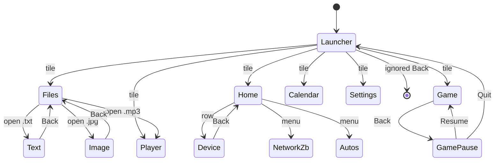
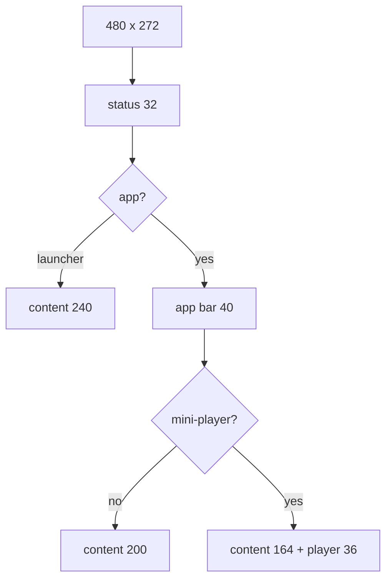
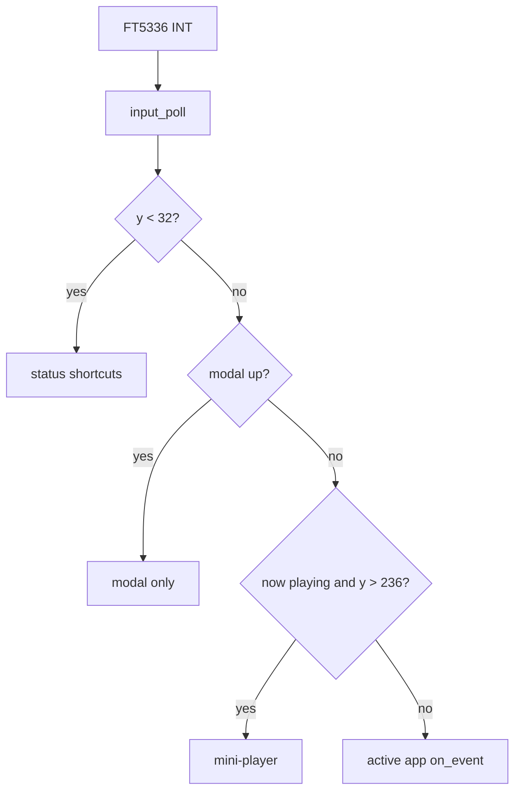
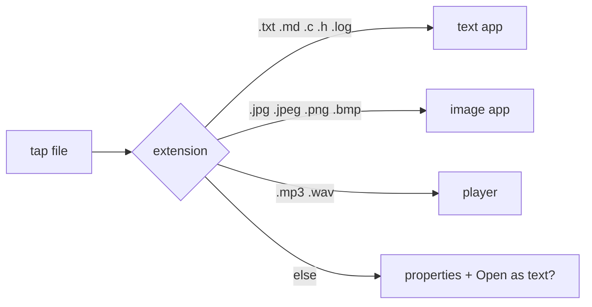
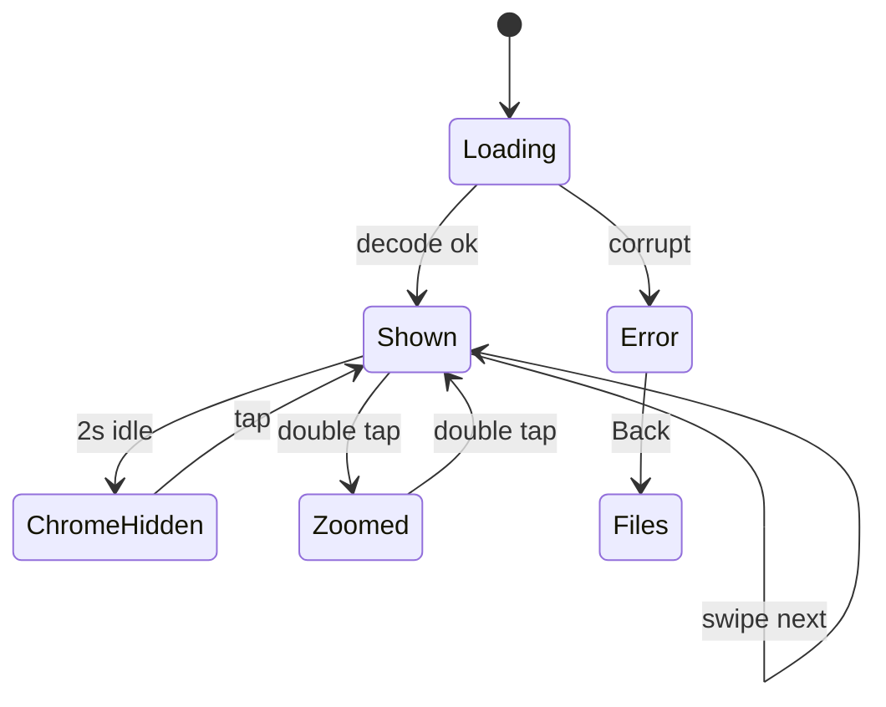
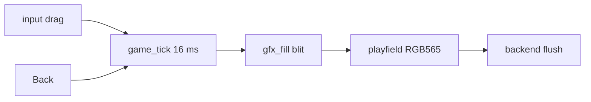
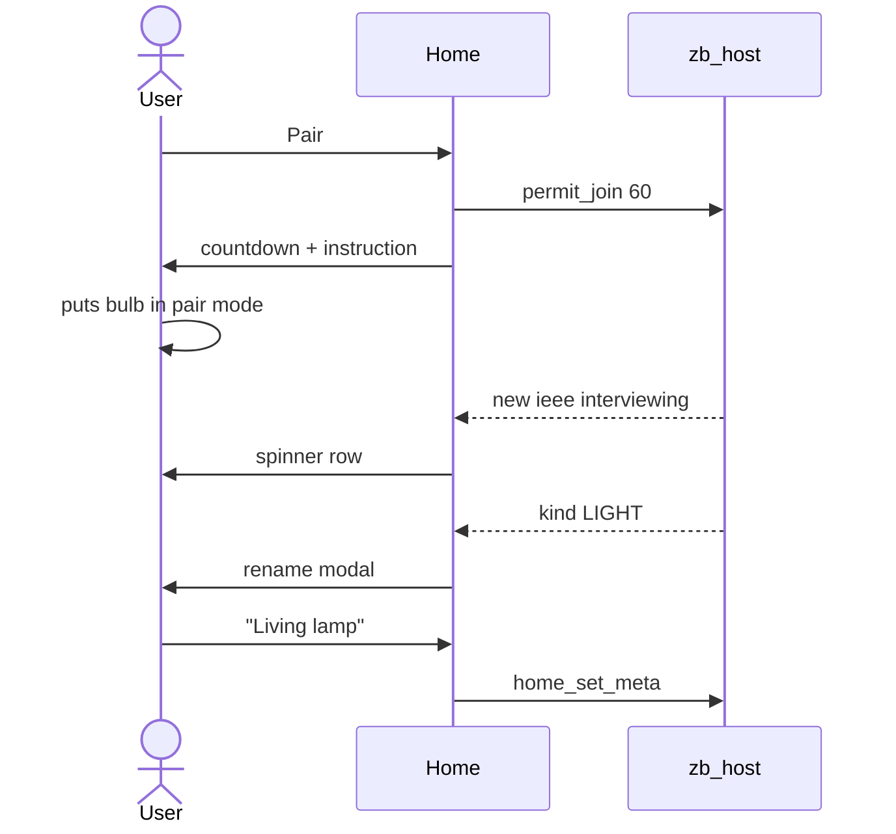

# UI Design

Target panel: 4.3" **480×272**, RGB, FT5336 capacitive multi-touch. Density ≈ 128 PPI. Design for fingers, not a mouse.

The shell is toolkit-agnostic. LVGL is the first backend; widgets below are roles, not LVGL type names.

**Contents:** 1 Dock drop · 2 Chrome · 3 Touch · 4 Theme · 5 Status · 6 Nav · 7 Screens · 8 Motion · 9 LVGL map · 10 Assets · 11 A11y · 12 Future · 13 Heights · 14 Touch dispatch · 15 Open-with · 16 Image states · 17 Game loop · 18 Pairing · 19 Strings · 20 Pixel budget

## 1. Why the v1 dock is dropped

v1 used a 50×272 left rail and a 430×242 canvas.

- 50 px is ~10 mm, below a 40 px / ~8 mm minimum hit target once padding exists.
- File lists, images, and text need width more than a persistent rail.
- A rail is extra chrome to reimplement when the toolkit changes.

v2 uses a **launcher + stack**, like a phone.

## 2. Layout chrome

```
480 px
┌──────────────────────────────────────────────────────────────┐  32 px  STATUS
│  12:34    ≣ eth  wifi?    eMMC    ♪ track…         80%      │
├──────────────────────────────────────────────────────────────┤
│  [BACK]   Title                                   [ACTION]   │  40 px  APP BAR
│                                                              │         (apps only)
│                      CONTENT  480 × 200–240                  │
│                                                              │
├──────────────────────────────────────────────────────────────┤
│  ♪  song name          [⏮] [⏯] [⏭]            1:02 / 3:20  │  36 px  NOW PLAYING
└──────────────────────────────────────────────────────────────┘         (audio only)
```

| Region | Size | When |
| --- | --- | --- |
| Status bar | 480×32 | Always |
| App bar | 480×40 | Any app except launcher |
| Content | 480×(200–240) | Always |
| Now playing | 480×36 | Audio active and not on the full player |

Launcher has no app bar: content is 480×240.

Safe content height:

- Launcher, idle: 240 px
- In-app, no audio: 200 px
- In-app + mini-player: 164 px

Do not add a second side rail.

## 3. Touch rules

- Minimum hit target **40×40 px**, spacing ≥ 8 px.
- List row height **44 px**.
- Scroll is vertical finger drag; flick allowed if the toolkit provides it.
- Tap = activate. Long-press (~450 ms) = properties / select.
- One-finger first. Two-finger pinch is image-viewer P1.
- No hover, no right-click, no 8 px close icons.
- Debounce hardware button (B1) as Home: pop to launcher.

## 4. Theme tokens

Dark industrial theme (hides TFT backlight bleed, good lab lighting).

| Token | Value | Use |
| --- | --- | --- |
| `bg` | `#12141A` | Screen |
| `surface` | `#1C212C` | Bars, cards |
| `surface_2` | `#262C3A` | Selected row |
| `accent` | `#3D8BFF` | Focus, links |
| `ok` | `#3DDC97` | Link up, play |
| `warn` | `#F5A524` | Degraded |
| `err` | `#F25F5C` | Error, offline |
| `text` | `#E8ECF1` | Primary |
| `muted` | `#8B93A7` | Secondary |
| `icon` | 24 px | Launcher 48 px glyph in 72 px tile |

Fonts (QSPI or internal):

- UI: 14 px regular, 16 px title, 12 px status/meta.
- Text viewer: 14 px, user can step 12/14/16/18.

Corner radius 8 px. 1 px hairline `#3A4154`.

Do not encode these as LVGL hex in app code; keep them in `ui/theme`.

## 5. Status bar

Left → right:

1. **Time** `HH:MM` (RTC). Tap opens Date/Time in Settings.
2. **Net cluster:** Ethernet icon (ok/warn/err), optional Wi-Fi icon if compiled in.
3. **Storage:** eMMC mounted (ok) or error.
4. **M4:** green while the M4 heartbeat is fresh; red if silent > 500 ms (or never up).
5. **Audio pill:** truncated title when playing; tap opens Player.
6. **Zigbee radio:** `ok` if ZNP up and network formed, `warn` if last-known only, `err` if UART/ZNP missing. Tap opens Home → Network.
7. **Activity:** thin indeterminate bar during FS/decode/interview/`home_cmd` (does not block touch).

Status bar is not a menu. No hamburger that hides primary navigation.

## 6. Navigation model

- Root: **Launcher**.
- `shell_push(app_id, args)` / `shell_pop()`.
- Hardware Home or launcher icon: pop to root.
- Back: pop one screen. At root, ignore.
- Deep links: explorer can push viewer with `{path}`; Back returns to the same folder and scroll offset.
- Modals: error, properties, volume. Modal blocks the app, not the status bar.

App registry (extensible):

| id | Title | P |
| --- | --- | --- |
| `files` | Files | P0 |
| `image` | Image (usually opened from Files) | P0 |
| `text` | Text (usually opened from Files) | P0 |
| `home` | Home | P1 |
| `game` | Game | P1 |
| `player` | Music | P1 |
| `calendar` | Calendar | P1 |
| `settings` | Settings | P1 |
| `network` | Network (Settings page; not a home tile) | P2 |



Home hardware button from any state: pop to Launcher (Game pauses first if playing).

## 7. Screens

### 7.1 Launcher

3×2 rounded-rect tiles (108×86, radius 16), 16 px gutter. Greeting row above the grid.

```
┌──────────┐  ┌──────────┐  ┌──────────┐
│  Files   │  │   Home   │  │   Game   │
└──────────┘  └──────────┘  └──────────┘
┌──────────┐  ┌──────────┐  ┌──────────┐
│  Music   │  │ Calendar │  │ Settings │
└──────────┘  └──────────┘  └──────────┘
```

All six tiles are product apps (P0/P1). Do not show disabled grey tiles that do nothing.

### 7.2 Files (explorer)

App bar: Back | truncated breadcrumb `/user/photos` | view-toggle (list/grid).

List (default):

```
[DIR]  photos/              >
[DIR]  notes/               >
[IMG]  front.jpg     812 KB
[TXT]  readme.txt     12 KB
[AUD]  track.mp3      3.4 MB
[UNK]  data.bin       1.1 MB
```

- Icon 32 px, name ellipsized, size for files only.
- Tap directory: enter. Tap file: open registered viewer. Unknown: Properties + “Open as text?”.
- Empty folder: illustration + “No files”.
- Unmounted eMMC: error + Retry.
- Grid view: 3 columns, thumbnail if image cache exists, else type icon.
- Do not show `/system`, QSPI, or `..` as a row; Back leaves the folder.
- Long-press: Properties (name, size, type, path). Delete/rename are P2 and require a confirm modal.

### 7.3 Image viewer

Immersive. App bar auto-hides after 2 s; tap to toggle chrome.

- Default: **contain** (fit whole image, letterbox `bg`).
- Pan when zoomed. Double-tap toggles fit / 100%.
- Swipe left/right: next/prev image in the same folder (skip non-images).
- Decode on a worker; show checker or spinner. On failure: modal and stay in folder.
- Max decode buffer per Architecture SDRAM map; larger images are downscaled on load.
- Do not rotate the LVGL screen; rotate pixels if EXIF says so (P2).

### 7.4 Text viewer

App bar: Back | filename | font-size.

- UTF-8, LF/CRLF.
- Word wrap on; horizontal scroll off for wrap mode.
- Windowed IO: keep ~N lines around the viewport (N ≥ 80). Files of tens of MB must not allocate the whole file.
- Progress: `12%` or line number in the bar.
- Unsupported encoding: warn and show replacement characters; do not crash.
- `.md` renders as plain text in P0; markdown styling is P2.

### 7.5 Player

Full screen when opened from launcher or the now-playing pill.

- Artwork 120×120 if a sibling `.jpg` or ID3 art exists, else placeholder.
- Title / artist (unknown if missing).
- Seek bar, elapsed / duration.
- Transport 40 px: prev, play/pause, next. Volume slider.
- Playlist = audio files in the current folder (simple, no database).

Mini-player (chrome): title + play/pause only. Tap title → full player.

### 7.6 Settings

List of rows (44 px): Brightness, Volume, Time, Network, **Zigbee**, **USB file transfer** (later), About (fw versions of M7/M4, ZNP version, LVGL, FS free space).

Brightness is persisted by `cfg_*` and applied as LTDC layer constant alpha (`disp_set_brightness`). No PWM/TIM IRQ.

Zigbee row: radio present/missing, channel, PAN, “Open network” shortcut. Full controls live in the Home app.

**USB file transfer** (later sprint): a toggle/page that starts exclusive USB MSC. Copy: the PC sees the whole FAT volume, including Home data; Files and audio stop until the cable is unplugged. Not a separate launcher app.

### 7.7 Network

- Ethernet: link, speed, IPv4, MAC.
- Wi-Fi page only if `NET_WIFI` compiled.
- Failover state machine shown as Ethernet → Wi-Fi, never both “primary”.

### 7.8 Game

App bar auto-hides during play (same as image viewer). Pause overlay on Back, Home, or tap-pause: Resume / Quit. Quit pops to launcher.

Playfield is the content region (typically 480×200). **Not** a widget tree of bricks.

```
┌──────────────────────────────────────────────────────────────┐
│  SCORE  120          LIVES  ●●●                   HIGH  840  │
│                                                              │
│                    [ bricks  ]                               │
│                                                              │
│                       (ball)                                 │
│  ████████  paddle  (finger drag on lower 56 px)              │
└──────────────────────────────────────────────────────────────┘
```

- First module: **Brick**. Drag anywhere on the lower band to move the paddle (40 px tall hit strip).
- One-finger only. No multi-touch gestures.
- Game-over modal: score, New game, Quit.
- High score persisted under `/user/game/brick.sav`.
- If music is playing, keep it; do not steal SAI. If FPS drops below 25, drop particles first, not the paddle.
- Opening Game shows a **library** (Brick + `/user/game` carts). Tap a row to run it.
- Extra cores later: same list, new `game_module_t` + file extension. CHIP-8 is the first eMMC cart (`.ch8` / `.c8`).
- Pause “Games” returns to the library; Back in the library returns to the launcher.
- CHIP-8: scaled 64×32 playfield + 4×4 keypad. Do not steal SAI.

### 7.9 Home

App bar: Back | Home | **[+ Pair]**  (and a ⋯ menu: Network, Automations).

Four screens: **Devices**, **Device**, **Network**, **Automations**. Devices is the default. The panel is the Zigbee coordinator UI.

**Devices** (list, not MQTT cards):

```
┌──────────────────────────────────────────────────────────────┐
│  Zigbee  ch 15   4 devices          [ Open join  59 s ]      │
│  Living lamp     💡  ON     LQI 210                          │
│  Hall switch     ⏻  OFF    LQI 180                          │
│  Front door      🚪 closed  2 min ago                        │
│  Motion stair    👁  clear                                  │
└──────────────────────────────────────────────────────────────┘
```

- One row per device, 44 px, type icon + name + primary state + LQI or last-seen.
- Unknown / interviewing: spinner + “Interviewing…”.
- Empty: “No devices. Tap Pair to open the network.”
- Radio down: amber banner “Radio not ready” + last-known list (toggles fail with toast).
- Light: toggle on the row (40 px). Switch: same. Sensor: read-only state.
- Tap row (not the toggle) → Device page.
- Filter chips P2: room / type. Rooms are a name on the device, not a Zigbee concept.

**Device**

- Friendly name (edit), room (edit).
- IEEE, NWK addr, endpoints (small meta, not the title).
- Cluster controls: OnOff, Level slider, zone/temp readout.
- Identify (blink), Remove from network (confirm modal).
- Last-seen and LQI.

**Network**

- Form / factory-reset coordinator (double confirm).
- Channel, PAN ID (read-only after form unless reset).
- Permit join: 60 s / 120 s / Off, with on-screen countdown (status bar too).
- ZNP version string from SYS ping.
- Device count.

**Pair** (modal or full screen during permit join)

- Countdown, “Put the device in pairing mode”.
- When a device announces: show IEEE, then interview progress, then “Rename and save”.
- Auto-close join when timer ends.

**Automations**

- List of local rules: name, trigger summary, enable switch.
- Editor (keep simple on 480×272): pick trigger device/attr, optional threshold, pick action device/cmd, optional delay.
- Empty: “No automations. Rules run on this board, no cloud.”
- Never show MT command names in the UI.

### 7.10 Common overlays

- **Toast** 2 s at bottom (copied, saved).
- **Modal:** title, two lines of body, primary + cancel. Primary is the safe action (OK / Retry). Destructive actions use `err` color and explicit “Delete”.
- **Busy:** modal spinner only if the user must wait; otherwise status activity bar.

## 8. Motion and performance

- Screen transition: 120–160 ms fade or short slide. Skip if framebuffer is busy.
- Target **≥ 20 FPS** while scrolling lists; **≥ 30 FPS** idle launcher.
- Explorer listing of 500 files: first screen in < 300 ms, rest incrementally.
- Image first paint: JPEG ≤ 2 MP in < 1 s typical from eMMC.
- Game playfield ≥ **30 FPS**.
- Home device list of 32 devices: first paint < 400 ms from eMMC cache; ZNP reports must not rebuild the whole list each frame.
- Never stall LVGL’s timer tick in a FS read, MT UART parse, interview, or game load. Use worker + `ui_async`.

## 9. Mapping to LVGL (backend only)

| Role | Suggested LVGL object |
| --- | --- |
| Shell | `lv_obj` screen + `lv_tileview` **or** manual screens |
| Status | top `lv_obj` + labels/images |
| Launcher | `lv_btn` matrix / flex grid |
| File list | `lv_list` or `lv_table` with lazy bind |
| Image | `lv_image` from canvas/RGB buffer, not a PNG file widget for large photos |
| Text | `lv_label` inside `lv_obj` scroll, text set from a window buffer |
| Player | standard sliders/buttons |
| Game playfield | `lv_canvas` or raw buffer; **not** one `lv_obj` per brick |
| Home cards | `lv_list` of device rows bound to `home_device_t` |

Do not use SquareLine/EEZ generated code as the app model. Generated UI, if used, stays in `ui/backend_lvgl`.

## 10. Assets

| Asset | Store |
| --- | --- |
| Icons, launcher glyphs, fonts | QSPI (or compiled-in C arrays for bring-up) |
| User photos, notes, music | eMMC `/user` |
| Game sprites / high scores | QSPI sprites; `/user/game` saves |
| Home cache | eMMC `/user/home` (devices, rules, names) + RAM table |
| Thumbs cache | eMMC `/cache/thumbs` (optional, P2) |

Icons: 24 px and 48 px, alpha, light-on-dark. One icon set, not per-toolkit bitmaps duplicated in SDRAM.

## 11. Accessibility and copy

- Contrast ≥ 4.5:1 for `text` on `bg`.
- Errors in plain language: “Storage not ready”, “Cannot open image”, “File is too large”, “Radio not ready”, “Join closed”, “Game paused”.
- English UI first; strings in a table for later i18n.

## 12. Future apps

USB file copy is Settings exclusive MSC (not a new app). Markdown preview, PDF, video, extra game modules, climate/scenes, MQTT export of `home_*`: new modules. No chrome change if they follow app bar + content.

## 13. Chrome height formula



Status icons (left to right, 8 px pad):

| Slot | Width | States |
| --- | --- | --- |
| Time | 56 | `HH:MM` |
| ETH | 24 | ok / warn / err / hidden |
| Wi-Fi | 24 | compiled-out = 0 width |
| eMMC | 24 | ok / err |
| M4 | 24 | ok / err |
| Zigbee | 24 | ok formed / warn last-known / err no radio |
| Audio pill | flex | hidden if stopped |
| Activity | 480×2 under bar | hidden if idle |

## 14. Touch dispatch



Hit test uses the 40 px minimum; if a label is smaller, the row still captures.

## 15. Files open-with



Scroll offset + selected index saved on a stack of folder records (max depth 16).

## 16. Image viewer states



## 17. Game (Brick) loop vs UI



Paddle hit strip: y in `[content_bottom-56, content_bottom]`. Ball radius 4 px, brick 48×16, 5 rows × 8 cols on 480×160 inner field.

## 18. Home pairing UX



Copy:

| Situation | Title | Body | Actions |
| --- | --- | --- | --- |
| Radio down | Radio not ready | Check the Zigbee module on STMod+ USART2. | Retry, Close |
| Join closed | Join closed | Open the network to add a device. | Open 60 s, Close |
| Remove device | Remove device? | It must be paired again later. | Cancel, Remove |
| Form network | Form network? | This creates a new Zigbee network. | Cancel, Form |

## 19. String table

All UI strings live in `ui/strings.c` (`STR_RADIO_DOWN`, …). No string literals in `src/app` except debug logs.

## 20. Pixel budget (launcher)

Origin top-left. Tiles: 72×72, gutter 16, grid origin (72, 40) inside the 480×240 content so the block is 248×160 centered: x = (480-248)/2 = 116, y = (240-160)/2 = 40.

